# attention - Project Index

## 📖 Project Overview

Auto-generated project index maintained by the Fractal Multi-level Index System.

## 📁 Directory Structure

```
├── ./ (2 files)
    ├── main/ (22 files)
      ├── cli/ (4 files)
    ├── preload/ (4 files)
  ├── web/ (5 files)
    ├── api/ (3 files)
    ├── app/ (17 files)
      ├── cli/ (2 files)
        ├── commands/ (10 files)
      ├── commands/ (2 files)
      ├── diagnostics/ (4 files)
      ├── hotkeys/ (3 files)
      ├── menus/ (1 files)
      ├── protocol/ (1 files)
      ├── release/ (6 files)
      ├── starter/ (2 files)
      ├── theme/ (4 files)
    ├── builtin/ (38 files)
      ├── canvas/ (5 files)
      ├── file-recovery/ (3 files)
      ├── git/ (9 files)
        ├── review/ (5 files)
      ├── github/ (23 files)
      ├── graph/ (9 files)
      ├── terminal/ (5 files)
      ├── theme-market/ (5 files)
      ├── webviewer/ (7 files)
    ├── core/ (7 files)
    ├── dom/ (3 files)
    ├── editor/ (7 files)
    ├── markdown/ (15 files)
    ├── metadata/ (10 files)
    ├── platform/ (1 files)
      ├── desktop/ (5 files)
      ├── mobile/ (4 files)
      ├── native/ (4 files)
      ├── shell/ (1 files)
      ├── window/ (2 files)
    ├── plugin/ (17 files)
      ├── packaging/ (2 files)
      ├── lib/ (1 files)
    ├── search/ (2 files)
    ├── storage/ (5 files)
    ├── ui/ (13 files)
      ├── drag/ (1 files)
      ├── hover/ (1 files)
      ├── suggest/ (5 files)
    ├── vault/ (7 files)
    ├── views/ (17 files)
      ├── properties/ (11 files)
      ├── workspace/ (19 files)
  ├── along/ (5 files)
  ├── tui/ (19 files)
  ├── agentloop/ (2 files)
  ├── ai/ (20 files)
    ├── oauth/ (7 files)
    ├── sseparse/ (1 files)
  ├── auth/ (3 files)
  ├── config/ (2 files)
  ├── execenv/ (2 files)
    ├── local/ (3 files)
  ├── extension/ (3 files)
  ├── harness/ (5 files)
  ├── hook/ (3 files)
  ├── message/ (2 files)
    ├── print/ (1 files)
    ├── rpc/ (2 files)
  ├── obs/ (2 files)
  ├── orchestrator/ (9 files)
  ├── plugin/ (3 files)
  ├── provider/ (3 files)
  ├── resource/ (7 files)
  ├── session/ (7 files)
  ├── tool/ (2 files)
    ├── builtin/ (18 files)
  ├── shared/ (6 files)
    ├── types/ (2 files)
├── scripts/ (2 files)
```

## 🔗 Dependency Graph

```plantuml
@startuml
skinparam componentStyle rectangle
skinparam shadowing false
component "app-protocol-register" as app_protocol_register
component "app-protocol" as app_protocol
component "CliClient" as CliClient
component "CliDispatch" as CliDispatch
component "CliServer" as CliServer
component "CliVaultRouter" as CliVaultRouter
component "desktop-bridge" as desktop_bridge
component "foundation-ipc" as foundation_ipc
component "ipc" as ipc
component "json-store" as json_store
component "main" as main
component "menu" as menu
component "net-request" as net_request
component "obsidian-protocol" as obsidian_protocol
component "obsidian-url" as obsidian_url
component "renderer-target" as renderer_target
component "session-hardening" as session_hardening
component "settings" as settings
component "starter-window" as starter_window
component "state" as state
component "system-fonts" as system_fonts
component "vault-registry" as vault_registry
component "vault-windows" as vault_windows
component "vite.config" as vite_config
component "window-state" as window_state
component "window" as window
component "git-bridge" as git_bridge
component "preload" as preload
component "terminal-bridge" as terminal_bridge
component "ObsidianPluginModule" as ObsidianPluginModule
component "PluginApiFacade" as PluginApiFacade
component "PublicApi" as PublicApi
component "App" as App
component "AppCommands" as AppCommands
component "AppDom" as AppDom
component "AppLifecycle" as AppLifecycle
component "AppProtocolHandlers" as AppProtocolHandlers
component "AttachmentImport" as AttachmentImport
component "BodyClasses" as BodyClasses
component "FileManager" as FileManager
component "FrameDom" as FrameDom
component "MetadataIndexingNotice" as MetadataIndexingNotice
component "MoveFileModal" as MoveFileModal
component "QuitEvent" as QuitEvent
component "SettingRegistry" as SettingRegistry
component "SettingTab" as SettingTab
component "SettingsSection" as SettingsSection
component "StatusBar" as StatusBar
component "WorkspaceServices" as WorkspaceServices
component "Cli" as Cli
component "coreMisc" as coreMisc
component "fileWrites" as fileWrites
component "graphLists" as graphLists
component "helpers" as helpers
component "linksOutlineCli" as linksOutlineCli
component "metadata" as metadata
component "navigation" as navigation
component "searchCli" as searchCli
component "wordcountWebCli" as wordcountWebCli
app_protocol --> renderer_target
CliDispatch --> CliVaultRouter
desktop_bridge --> net_request
desktop_bridge --> system_fonts
foundation_ipc --> state
ipc --> vault_registry
net_request --> ipc
obsidian_protocol --> obsidian_url
obsidian_protocol --> vault_registry
obsidian_url --> vault_registry
session_hardening --> renderer_target
settings --> json_store
settings --> vault_registry
starter_window --> main
starter_window --> renderer_target
vault_windows --> main
vault_windows --> json_store
window_state --> json_store
window --> main
preload --> terminal_bridge
ObsidianPluginModule --> App
ObsidianPluginModule --> SettingTab
PluginApiFacade --> PublicApi
PublicApi --> App
AppCommands --> App
AppLifecycle --> App
AppLifecycle --> MetadataIndexingNotice
AppProtocolHandlers --> App
FileManager --> App
FileManager --> AttachmentImport
FrameDom --> BodyClasses
MoveFileModal --> App
SettingRegistry --> App
SettingRegistry --> SettingTab
SettingTab --> App
SettingTab --> SettingRegistry
WorkspaceServices --> App
Cli --> App
coreMisc --> App
fileWrites --> App
graphLists --> App
graphLists --> Cli
metadata --> App
metadata --> Cli
navigation --> App
navigation --> Cli
searchCli --> App
@enduml
```



## 📊 Statistics

- Total folders: 78
- Total files: 502

---

🔄 **Self-reference**: When project structure changes, update this index

🎼 Generated by [Project Multilevel Index](https://github.com/Claudate/project-multilevel-index)
