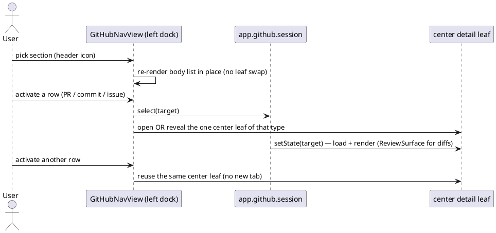

=== Contract ===

# Task Contract: github-obsidian-native-nav

## Intent

The GitHub core plugin still _feels_ like a web app, not Obsidian: every click
swaps a full-page `ItemView` (list → detail on the active leaf), you navigate
back with breadcrumb "← Pull requests" / "← Commits" buttons, and you change
section through a header dropdown menu. That is the "各种跳转" the user rejects.

Make GitHub navigate like the **file explorer**: one persistent left-dock
navigator leaf lists the active section's items and _drives_ the center, where
the selected PR / commit / issue opens as a reused center tab. No page-swaps,
no breadcrumbs, no in-content section dropdown. This is the same shape the
sibling `git` plugin already uses (right-dock `GitNavView` + center
`GitReviewView` bridged by a `GitReviewSession`), applied left-docked here.

## Current State

- Four standalone `ItemView`s page-swap the active leaf: `github-workspace`
  (`GitHubWorkspaceView`), `git-prs` (`PrListView`), `git-pr` (`PrDetailView`),
  `git-commit` (`GitCommitView`).
- Section switch is a **dropdown menu** in the view header (`showSectionMenu`).
- Detail views carry breadcrumb **"← back" link-buttons** (`linkButton`) and
  reload a list view to go back.
- `GitCommitView` and `PrDetailView` each hand-roll a **split-pane diff**
  (`gh-file-tree` / `git-pr-files-split` + `renderPatch`) that duplicates what
  the shared `ReviewSurface` already does; `PrDetailView` even offers a nested
  "File tree | Full review" segmented toggle where "Full review" _is_
  `ReviewSurface`.
- The four extra panels (`GitHubExtraPanels`: issues / actions / files / inbox)
  each build their own `gh-split-panel` (list+detail split _inside_ the center)
  — a second, bespoke navigation model.
- There is **no coordinator**: views resolve repo/auth independently.
- The prior goal `github-obsidian-leaf-nav` deliberately shipped the active-leaf
  drill-down + header-dropdown model and listed the side-docked navigator as

## UX Shape

## Must

- pnpm is the only package manager; a preinstall hook rejects npm and yarn.
- Fail fast on product paths: a missing configuration raises an explicit
- The full vitest suite is green before any merge.
- Keep the perf budget on the 20k-file vault: openFile median under 50ms
- Code stays name-agnostic: no product-name literal appears anywhere in the

## Must NOT

- Do not add a production dependency without a goal contract that adopts it.
- Do not weaken, skip, or delete an existing test to make a gate pass.
- Do not source a default from anywhere but the user's explicit configuration.

## Decisions

- One app, one package: the repo root is the single application package; its
- The native seam is ports-and-adapters: the shell fills the ports the renderer
- Dual-track plugin architecture: `builtin/` is the internal track and may use
- Kernel direction rule: `vault/`, `metadata/`, and `storage/` import only from
- Disk access stays in-process behind the `DataAdapter` seam in the renderer
- Unit tests are centralized under `tests/` (workspace member), mirroring
- The docs household is docwright goals under
- **Left-dock navigator.** A new `GitHubNavView` (VIEW_TYPE `github-nav`) opens
- **Section switch is in the nav header, one section at a time.** Compose the
- **Nav drives the center (outline-view idiom).** Activating a row opens the
- **`GitHubSession extends Events`** lives on `app.github` (mirrors
- **Reuse `ReviewSurface` for every diff.** `PrDetailView` (Files-changed tab)
- **No breadcrumbs / no back-buttons in detail views.** The persistent left nav
- **Remove `GitHubWorkspaceView` and `PrListView`.** Their section lists move
- **Reuse only Obsidian primitives** for new UI: `TreeItem` (with faithful
- **No GitHub API / auth / token / network changes.** `GitHubClient`,
- **Legacy view-type ids kept**: `git-pr`, `git-commit` unchanged (avoids state

## Boundaries

Allowed changes:

- `src/renderer/builtin/github/**`
- `src/renderer/builtin/git/review/ReviewSurface.ts` — **reuse only**, no edits
- `src/renderer/styles/product/git-prs.css` and a new
- `src/renderer/builtin/github/GitHubService.ts` — add the session object only
- `tests/web/builtin/github/**`
- `docs/architecture/github-obsidian-native-nav/**`
  Forbidden:
- No new runtime dependency or UI framework.
- No second tree / search / menu / notice primitive beside Obsidian's.
- No changes to `GitHubClient` network layer or auth/token model.
- No edits to the local `git` plugin, `GitReviewSession`, or `GitNavView`.
- No faithful-stylesheet edits outside `styles/product/**`.
- No page-swap drill-down (converting the active center leaf into a detail),
  Out of scope:
- Renaming legacy view-type ids `git-pr` / `git-commit`.
- Changing GitHub API, auth, device-login, or token storage behavior.
- Extracting a shared SCM UI kit across the git and github plugins (the session
- New GitHub capabilities beyond porting the seven existing sections.
- Real-network integration tests (web tests stub `app.github`).

## Completion Criteria

Rule: left-dock-nav — The navigator is a persistent left-dock leaf
Scenario: Opening the GitHub navigator docks it on the left
Test:
Package: workbench
Filter: docks the github navigator in the left split
Level: e2e
Given an authenticated GitHub session with a resolved repository
When the user opens the GitHub navigator
Then a `github-nav` leaf exists in the left split
And no `github-workspace` center leaf is created

Rule: unauthenticated-prompt — Without auth the navigator prompts to connect
Scenario: Unauthenticated navigator shows a connect prompt, not a list
Test:
Package: workbench
Filter: shows a connect prompt when unauthenticated
Level: e2e
Given no GitHub token is present
When the user opens the GitHub navigator
Then the navigator shows a Connect-GitHub prompt
And no section list is rendered

Rule: section-switch-in-place — Switching sections never swaps leaves
Scenario: Switching section re-renders the nav body without opening a leaf
Test:
Package: workbench
Filter: switches section in place without changing leaf count
Level: e2e
Given the GitHub navigator is open on the commits section
When the user activates the branches section from the nav header
Then the nav body shows branch rows
And the total workspace leaf count is unchanged

Rule: nav-drives-center — Activation opens then reuses one center leaf
Scenario: Activating pull requests opens and then reuses a single center leaf
Test:
Package: workbench
Filter: opens then reuses a single center detail leaf
Level: e2e
Given the GitHub navigator is open on the pull-requests section
When the user activates one pull request and then another
Then exactly one `git-pr` center leaf exists
And that leaf shows the most recently activated pull request

Rule: reviewsurface-diffs — Detail views render diffs via ReviewSurface
Scenario: Pull-request detail renders its diff through the shared ReviewSurface
Test:
Package: workbench
Filter: renders pull-request diff via the shared review surface
Level: e2e
Given a pull request with changed files is activated from the navigator
When its detail view renders the Files-changed tab
Then the diff is rendered by `ReviewSurface` (its file sidebar is present)
And no breadcrumb back-control is rendered

Scenario: Commit detail renders its diff through the shared ReviewSurface
Test:
Package: workbench
Filter: renders commit diff via the shared review surface
Level: e2e
Given a commit is activated from the navigator
When its detail view renders
Then the diff is rendered by `ReviewSurface`
And no bespoke `gh-file-tree` split-pane is present

Rule: session-coordination — The session refreshes nav on repo change
Scenario: Changing the active repository refreshes the navigator list
Test:
Package: workbench
Filter: refreshes the navigator when the repository changes
Level: e2e
Given the GitHub navigator is showing one repository's pull requests
When the active repository changes through the GitHub session
Then the navigator reloads and shows the new repository's list

=== Codebase Context ===

Files (22):

- docs/architecture/github-obsidian-native-nav/spec.md
- src/renderer/builtin/github/GitHubClient.ts
- src/renderer/builtin/github/GitHubExtraPanels.ts
- src/renderer/builtin/github/GitHubPlugin.ts
- src/renderer/builtin/github/GitHubService.ts
- src/renderer/builtin/github/GitHubWorkspace.ts
- src/renderer/builtin/github/GitPrViews.ts
- src/renderer/builtin/github/open.ts
- src/renderer/builtin/github/patchUtils.ts
- src/renderer/builtin/github/prefs.ts
- src/renderer/builtin/github/resolveRepository.ts
- src/renderer/builtin/github/types.ts
- tests/web/builtin/github/GitHubClient.test.ts
- tests/web/builtin/github/GitHubLeafNav.test.ts
- tests/web/builtin/github/GitHubNativeNavigation.test.ts
- tests/web/builtin/github/GitHubService.test.ts
- tests/web/builtin/github/GitHubWorkspace.test.tsx
- tests/web/builtin/github/GitPrViews.test.tsx
- tests/web/builtin/github/commits.test.ts
- tests/web/builtin/github/extraApi.test.ts
- tests/web/builtin/github/patchUtils.test.ts
- tests/web/builtin/github/resolveRepository.test.ts

=== Task Sketch ===

Group 1 (order 1):
Scenarios: - Opening the GitHub navigator docks it on the left - Unauthenticated navigator shows a connect prompt, not a list - Switching section re-renders the nav body without opening a leaf - Activating pull requests opens and then reuses a single center leaf - Pull-request detail renders its diff through the shared ReviewSurface - Commit detail renders its diff through the shared ReviewSurface - Changing the active repository refreshes the navigator list
Boundary paths: - src/renderer/builtin/github/** - src/renderer/builtin/git/review/ReviewSurface.ts` — **reuse only**, no edits
    - src/renderer/styles/product/git-prs.css` and a new - src/renderer/builtin/github/GitHubService.ts` — add the session object only - tests/web/builtin/github/** - docs/architecture/github-obsidian-native-nav/**
Test selectors: - docks the github navigator in the left split - shows a connect prompt when unauthenticated - switches section in place without changing leaf count - opens then reuses a single center detail leaf - renders pull-request diff via the shared review surface - renders commit diff via the shared review surface - refreshes the navigator when the repository changes

=== Warnings ===

- Allowed Changes path not found: src/renderer/styles/product/git-prs.css` and a new (resolved to ./src/renderer/styles/product/git-prs.css` and a new)
- Allowed Changes path not found: src/renderer/builtin/github/GitHubService.ts` — add the session object only (resolved to ./src/renderer/builtin/github/GitHubService.ts` — add the session object only)
