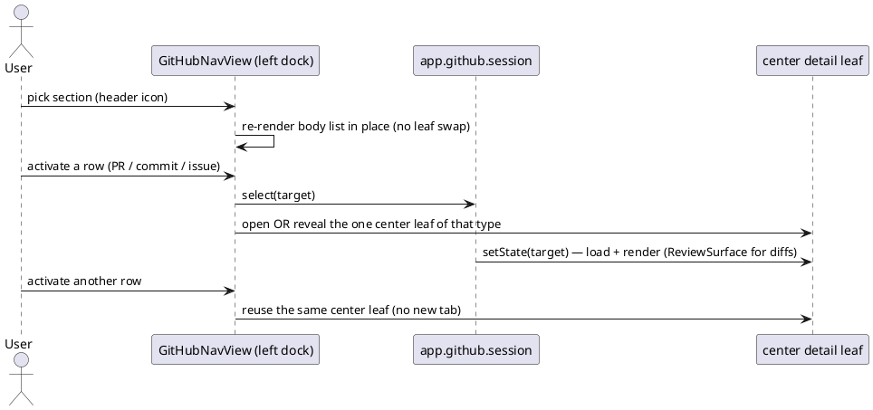

spec: task
name: "github-obsidian-native-nav"
inherits: project
tags: [architecture, github, workspace]
test_command: pnpm vitest run tests/web/builtin/github/GitHubNativeNavigation.test.ts -t "{selectors}" --reporter=junit --outputFile=.docwright/report.xml
test_report: .docwright/report.xml
---

## Intent

The GitHub core plugin used to *feel* like a web app, not Obsidian:
full-page `ItemView`s page-swapped the active leaf, breadcrumb "← back"
buttons, a header dropdown to change section — the "各种跳转" the user rejects.
An interim fix (a left-dock nav whose header held a 7-icon section switcher and
whose body held the section's **content list**) failed differently: GitHub is
content-heavy, and a thin sidebar is the wrong home for PR/issue rows and repo
browsing. The header-switcher idea itself was right — the mistake was making
the narrow body carry content. The sidebar is a remote control, the center is
the screen.

Model the surface on **Oh My GitHub** (the shape the earlier code aimed at),
mapped onto the host's own three-pane chrome so it is *not* an app-in-app:

- **A — sidebar = a thin remote control, never a screen.** A persistent
  left-dock leaf whose **header owns the one-level navigation**: four section
  icons — Inbox | Pull Requests | Issues | Organizations — and nothing else
  (no Refresh button; sections refresh on activation). The body renders only the active section's thin items (query names,
  org logins); content rows, filters and repo lists always live in center
  tabs. GitHub is participation-first, not repo-first: there is **no
  Open-repository entry and no Repositories group** — an organization's center
  list is the only door into single-repo browsing. Activating a query opens a
  center list tab.
- **B — single-repo browsing = a repository center tab whose view-header owns a
  segmented sub-view switcher** (Overview / Pull requests / Commits / Branches /
  Issues / Actions / Files). Switching re-renders the body in place and
  records leaf history (sections are navigation targets, not modes); the
  header switch is never a nested sidebar. Drilling into a PR / commit /
  file opens a separate detail tab.
- **C — headers do the state switching; tabs stay few; history works.** Both the
  nav's own header and every center tab's view-header carry the state switch
  (section icons in the nav, segmented controls in list/repo tabs), so changing
  what you look at re-renders in place instead of minting leaves. Center
  navigation goes through `setViewState` on a reused leaf, which records
  per-leaf history — the host's native back/forward buttons walk it.

The host's left dock is Oh My GitHub's sidebar; the host's center tabs are its
tab bar; each view is a native leaf. No page-swaps, no breadcrumbs, no embedded
workspace shell.

## Current State

- Four standalone `ItemView`s page-swap the active leaf: `github-workspace`
  (`GitHubWorkspaceView`), `git-prs` (`PrListView`), `git-pr` (`PrDetailView`),
  `git-commit` (`GitCommitView`).
- Section switch is a **dropdown menu** in the view header (`showSectionMenu`).
- Detail views carry breadcrumb **"← back" link-buttons** (`linkButton`) and
  reload a list view to go back.
- `GitCommitView` and `PrDetailView` each hand-roll a **split-pane diff**
  (`gh-file-tree` / `git-pr-files-split` + `renderPatch`) that duplicates what
  the shared `ReviewSurface` already does; `PrDetailView` even offers a nested
  "File tree | Full review" segmented toggle where "Full review" *is*
  `ReviewSurface`.
- The four extra panels (`GitHubExtraPanels`: issues / actions / files / inbox)
  each build their own `gh-split-panel` (list+detail split *inside* the center)
  — a second, bespoke navigation model.
- There is **no coordinator**: views resolve repo/auth independently.
- The prior goal `github-obsidian-leaf-nav` deliberately shipped the active-leaf
  drill-down + header-dropdown model and listed the side-docked navigator as
  out of scope. This goal supersedes those two decisions.

## UX Shape

## Decisions

- **A — nav header = four section icons, nothing else.** `GitHubNavView`
  (VIEW_TYPE `github-nav`) opens via
  `workspace.ensureSideLeaf("github-nav", "left", …)`. Its `nav-header`
  buttons row (`nav-action-button`, the FileExplorer pattern) carries three
  mutually exclusive section icons — **Pull Requests | Issues |
  Organizations** — plus the **Inbox action**, and nothing else. Inbox follows
  the installed OMG app (a pure entry, zero sidebar content) with one
  addition the owner asked for: the icon carries an **unread-count badge**.
  Activating it opens (or focuses) the center inbox and leaves the body on
  the current section — the sidebar never renders notification rows. **Search has no sidebar presence at
  all** (owner's round-4 call — no header icon, no body row): the GitHub
  suggest modal is reached only through the `github:search` command. **No Refresh button in any
  GitHub header** — neither the nav's nor the list/repo/detail view-headers
  (owner's call: every surface reloads when entered or retargeted; the
  `github:refresh` command remains for manual refresh).
  Activating a section swaps the body in place to that section's thin list;
  it never mints a leaf. **The Open-repository action and `RepoSuggestModal`
  are removed** — GitHub is navigated by participation, not by picking a
  repo.
- **A — thin section bodies.** The body renders only the active section's
  navigation items via `TreeItem`: PR queries {Created by Me, Needs Review,
  Mentioned Me, Assigned to Me}; Issue queries {Created by Me, Mentioned Me,
  Assigned to Me}; Organizations = **the signed-in user first** (their profile
  entry, the OMG shape), then org logins — so the section is never empty for
  an account with no orgs. **The center inbox carries all notification
  content and richness** (the OMG inbox-page shape, filtered through the
  round-5 search-field decision): one native `SearchComponent` with qualifier
  suggestions (`is:unread` / `is:all`, `reason:…`) in place of any button
  row, a single Mark-all-as-read action, and rows of `unread dot + type icon
  + repo (small) / title (bold when unread) + reason badge + relative age`,
  laid out readably rather than densely. Hover row actions (done /
  unsubscribe) are a follow-up. No repo dump, no avatars, no filters in the
  sidebar: content density belongs to center tabs.
- **Notification clicks use the OMG hybrid semantics** (verified against the
  installed app's `resolveNotificationTarget` and `notificationHtmlUrl`,
  two branches only): a PR or issue notification with a number opens the
  **in-app detail leaf**; everything else opens the **external browser** via
  `notificationWebUrl(subjectUrl, repositoryHtmlUrl)` — the OMG mapper shape:
  string-map the certain subject types (`pulls`→`pull`, `commits`→`commit`,
  `issues`), and for anything unmappable fall back to the notification's
  `repository.html_url` (the field exists on the notifications API;
  `NotificationItem` carries it). The mapper **always returns a URL** — there
  is no "unmappable" state, no in-app repo tab, no invented URLs. Mark-read
  runs optimistically in the background and never gates navigation.
- **A — cross-repo query lists.** `GitHubListView` (VIEW_TYPE `github-list`) is a
  center tab rendering a cross-repo involvement query (PRs / issues by created /
  review-requested / mentioned / assigned), an organization's repositories, or
  the notifications inbox. Each row shows its own repo (the cross-repo signal);
  activating a PR / issue opens a detail tab. Its view-header owns a segmented
  query switcher (the same queries the sidebar offers for that entity), so the
  active list re-targets in place without touching the sidebar.
- **A — org/user profile tab.** Activating an organization (or the signed-in
  user) opens `GitHubProfileView` (VIEW_TYPE `github-profile`), a center tab
  modeled on Oh My GitHub's profile page: identity head (avatar, login, counts)
  and a header-segmented sub-view switch — **Overview | Repositories | Stars
  | Followers | Sponsors** (owner's final call: the OMG screenshot's full set,
  switched as view-header handlers). OMG renders these sections as an in-page
  vertical nav card; we deliberately map that to the tab's **view-header**
  segmented control (owner's call) — never a second in-page sidebar column.
  The **Overview body carries the OMG content blocks in order**: Pinned
  repositories (Custom Pins deferred), the contribution heatmap (year
  switcher, GraphQL `contributionsCollection` — copy OMG's query shape, do
  not invent one), and the four stat tiles (Commits / Pull requests / Code
  review / Issues). Stars and Followers lists ride REST where it suffices;
  pinned items and contribution data come from the repo's first GraphQL
  client module (data layer and view layer are split between owners with a
  typed interface boundary). The profile's repository rows are the **only**
  door into a `github-repo` tab.
- **Global search = the host's document-search idiom, hidden until summoned**
  (owner's final round-5 call: "像 Obsidian 原生的，平时不出现，Command F 再
  出现"). **⌘F reaches the GitHub view through its own view scope, not a
  second global hotkey**: each `View` owns a child `Scope` (`View.ts:46`)
  that the workspace pushes for the active leaf (`Workspace.ts:345`) and the
  keymap consults innermost-first (`Keymap.ts:57`) — so a ⌘F registered on
  the GitHub view's scope fires only while that leaf is active, and the
  editor's global `editor:open-search` is never contended. (A global second
  ⌘F command would be silently swallowed: the hotkey dispatcher discards
  `checkCallback` results — probe-verified — so there is no fall-through.)
  The summoned UI is the **document-search-style bar at the top of that
  leaf** (`document-search.css` idiom — in-flow, panel-width, no floating
  chrome); the as-you-type suggestion list (task #8's engine, reskinned
  only) drops below it; Esc dismisses and the bar is gone without trace.
  `github:search` (⌘P) and the "Search GitHub for …" tail row of any page's
  search field summon the same bar. No sidebar entry, no ribbon icon, no centered modal, no
  invented top-right chrome.
  Merging into the host's file search was ruled out on signature grounds,
  not taste: `registerSearchOperator` filters `TFile` and `search()` returns
  `VaultSearchResult[]` — the engine cannot yield GitHub entities without
  rewriting the faithful layer. The
  input and its as-you-type suggestion list (the signed-in user's and orgs'
  repositories, the fixed PR/issue queries, the inbox — the engine task #8
  shipped, reskinned only) drop down from that fixed anchor; Esc dismisses.
  No sidebar entry, no second ribbon search icon (the host ribbon's Search
  stays file search alone).
- **Every center list carries one native `SearchComponent`** (owner's
  round-5 call: operators over buttons): typing filters the current rows;
  typed qualifiers surface as suggestions (`is:unread` / `reason:…` on the
  inbox, `repo:…` on cross-repo lists) and **replace the inbox's button row**
  (Unread | All toggle and reason chips are gone; Mark-all-as-read stays as a
  single header action). The issue/PR open-closed state switch lives in the
  **view-header** as segmented icons (owner's explicit call), with `state:`
  available as a supplementary qualifier. The suggestion dropdown's last row
  is "Search GitHub for …", which opens the fixed top-right global search.
- **Issue detail = the OMG issue-page shape** (task #5's acceptance basis,
  verified against the installed app): header carries the state chip, number
  and created/updated meta; a **right-hand meta column** holds Assignees,
  Labels, Milestone, Participants and the Close/Reopen actions. The in-page
  column ban applies to **navigation** columns only — meta content columns
  are the OMG/GitHub idiom and allowed. The body is a **mixed timeline**:
  comments and events (labeled / assigned / closed / referenced …)
  interleaved chronologically, not a bare comment list. Editable title,
  subscribe / lock / pin / delete are follow-ups.
- **Real view-header, no fake headers.** The `ItemView` base already builds the
  real chrome (`headerEl` / `navButtonsEl` / `titleEl` / `actionsEl` /
  `addAction()`, with back/forward wired to `history-change`). GitHub views
  mount their titles, segmented controls and actions **into that header**; the
  content-drawn header bars (`github-list-header` and kin) are deleted, not
  restyled. Segmented controls attach to `headerEl` directly since
  `addAction()` only makes icon buttons. **Segment items are icon buttons with
  tooltips** (owner's call): native `button type=button` elements carrying the
  host's `clickable-icon` styling — never raw browser button chrome (no
  default borders/shadows) and no text labels crowding the header. This flat
  treatment extends to **every row, pager, chip and nav control** on GitHub
  surfaces: themed form-control styling (shadow/background) is reserved for
  true form buttons only (sign-in, comment submit).
- **History opt-in per view — two declarations, both required.** History for
  same-type in-place re-targets only records when the view opts in **twice**
  (the full `FileView` pattern): (1) the view declares `navigation = true`
  (`View.navigation` defaults to false and `recordHistory` returns early
  without it — `WorkspaceLeaf.ts` `recordHistory`), and (2) its
  `setState(state, result)` sets `result.history = true`. Either alone leaves
  back/forward dead. All five GitHub center views (`github-list`,
  `github-repo`, `git-pr`, `git-commit`, `github-detail`) and any future one
  (`github-profile`) declare both.
- **B — repository tab with header sub-views.** `GitHubRepoView` (VIEW_TYPE
  `github-repo`) is a center tab for one repo. Its header owns a segmented
  control (Overview / Pull requests / Commits / Branches / Issues / Actions /
  Files); clicking a segment re-renders the body in place and records leaf
  history (a section is a navigation target the native back/forward walks,
  not a mode). It is **not** a nested sidebar. Drilling into a PR / commit /
  issue / file / run opens a separate detail tab.
- **Center-leaf reuse — one leaf per type, history-first.** Every open goes
  through `setViewState` on a reused leaf: **one** `github-list` leaf (any
  query / org / inbox re-targets it), **one** `github-repo` leaf (another repo
  re-targets it), and one detail leaf per type (`git-pr`, `git-commit`,
  `github-detail`). No implicit tab minting — a second tab exists only when the
  user asks for it (cmd/ctrl-activate opens in a new leaf). Each in-place
  re-target records leaf history, so the native back/forward controls return to
  the previous query / repo / detail.
- **`GitHubSession extends Events`** on `app.github` (mirrors `GitReviewSession`
  on `app.git`): holds the active `target` (query / inbox / repo), `selection`,
  and pinned `repo`; emits `target-change`, `selection-change`, `repo-change`.
  Nav highlights the active target; lists/repo tabs highlight the open detail.
  A per-plugin session, **not** a shared SCM library. **The session is written
  in exactly one place: each view's `setState()`** (the only entry every path
  shares — open, back, forward). `open.ts` only picks the leaf and calls
  `setViewState`; it performs no session/pin side effects, so native history
  navigation can never desync the session, nav highlight or pinned repo from
  the rendered content.
- **Cross-repo search** is added to `GitHubClient.searchInvolvement(kind, query)`
  via `/search/issues` with no repo qualifier; `GitHubSearchItem` carries the
  item's own `owner`/`repo`. Existing repo-scoped calls are unchanged.
- **Reuse `ReviewSurface` for every diff.** `PrDetailView` and `GitCommitView`
  mount `ReviewSurface` (`showFileSidebar: true`); no bespoke split-panes, no
  breadcrumb back-buttons.
- **Reuse only Obsidian primitives** for new UI: `TreeItem`, `SearchComponent`,
  `Menu` (context menus only), the `github-segmented-control`, `Notice`,
  `setIcon`. No new row/dropdown/notice protocol. Product CSS lives only in
  `styles/product/` (`github-nav.css`); no faithful-layer edits.
- **No GitHub auth / token / network-layer changes.** `GitHubClient` gains only
  the cross-repo search method; `GitHubService` gains a session + a search
  wrapper.
- **Legacy view-type ids kept**: `git-pr`, `git-commit`, `github-detail`.
  `github-workspace` / `git-prs` removed; `github-list` / `github-repo` added;
  `github-nav` rebuilt as the query tree.

## Boundaries

### Allowed Changes
- `src/renderer/builtin/github/**`
- `src/renderer/styles/product/git-prs.css`
- `src/renderer/styles/product/github-nav.css`
- `src/renderer/styles/index.css`
- `src/renderer/builtin/CorePlugins.ts`
- `src/renderer/builtin/git/GitChangesView.ts`
- `tests/web/builtin/github/**`
- `tests/web/builtin/git/GitPlugin.test.ts`
- `docs/architecture/github-obsidian-native-nav/**`

`ReviewSurface.ts` is reused only (no edits unless a genuinely missing
capability forces extending the shared primitive — then extend, never fork).
`GitHubService.ts` (under the github tree above) gains only the session object.
`github-nav.css` is new; its import is registered in `styles/index.css`.
`CorePlugins.ts` and `git/GitChangesView.ts` change only by repointing the two
call sites that imported the removed `openPrList` / `openGitHubWorkspace` to the
new `openGitHubNav` — no git-plugin logic changes.

### Forbidden
- No new runtime dependency or UI framework.
- No second tree / search / menu / notice primitive beside Obsidian's.
- No auth / token / transport changes to `GitHubClient` beyond adding the
  cross-repo `searchInvolvement` query method.
- No changes to git review/session logic (`GitReviewSession`, `GitNavView`,
  `GitReviewView`, `ReviewSurface`); only the forced import repoint in
  `GitChangesView.ts` is allowed.
- No faithful-stylesheet edits outside `styles/product/**`.
- No page-swap drill-down (converting the active center leaf into a detail),
  no breadcrumb back-buttons, no header section dropdown — the anti-patterns
  this goal removes.

## Completion Criteria

### Rule: left-dock-nav — The navigator is a persistent left-dock leaf

Scenario: Opening the GitHub navigator docks it on the left
  Test: docks the github navigator in the left split
  Given an authenticated GitHub session
  When the user opens the GitHub navigator
  Then a `github-nav` leaf exists in the left split
  And no `github-workspace` center leaf is created

### Rule: unauthenticated-prompt — Without auth the navigator prompts to connect

Scenario: Unauthenticated navigator shows a connect prompt, not a tree
  Test: shows a connect prompt when unauthenticated
  Given no GitHub token is present
  When the user opens the GitHub navigator
  Then the navigator shows a Connect-GitHub prompt
  And no query tree is rendered

### Rule: nav-header-sections — The nav header switches sections; Inbox is an action

Scenario: The navigator header offers the four sections and nothing else
  Test: renders four header sections without a repo picker
  Given an authenticated GitHub session
  When the GitHub navigator loads
  Then the nav header shows Inbox, Pull Requests, Issues and Organizations
    icons and no Refresh and no Search action
  And no Search row appears anywhere in the body
  And the default body lists the pull-request queries
  But no Open-repository action and no Repositories group is rendered

Scenario: The search command suggests targets and opens the pick
  Test: opens a target from the github search suggest modal
  Given the GitHub search panel was opened via the github:search command
  When the user types a repo name fragment and picks the suggestion
  Then a `github-repo` center leaf opens for the picked repository

Scenario: The global search appears as the leaf's document-search bar
  Test: summons the github search bar on the active leaf
  Given an active GitHub center leaf with no search bar visible
  When the user invokes the find command on that leaf
  Then a document-search-style bar appears at the top of that leaf
  And no centered modal container is created

Scenario: Escape dismisses the search bar without a trace
  Test: dismisses the github search bar on escape
  Given the GitHub search bar is open on the active leaf
  When the user presses Escape
  Then the bar is removed and the leaf's content is unchanged

Scenario: An inbox qualifier filters the rows without any button row
  Test: filters the inbox through a typed qualifier
  Given the center inbox lists read and unread notifications
  When the user types the `is:unread` qualifier into the inbox search field
  Then only unread rows remain visible
  And no Unread/All toggle or reason chip buttons exist on the page

Scenario: A header section icon swaps the body in place
  Test: switches nav sections from the header icons
  Given the GitHub navigator on the Pull Requests section
  When the user activates the Issues section icon in the nav header
  Then the same nav leaf's body lists the issue queries instead
  And the total workspace leaf count is unchanged

Scenario: The Inbox action badges its count and opens the center list
  Test: opens the inbox from the nav header icon
  Given the GitHub navigator on the Pull Requests section
  When the user activates the Inbox icon in the nav header
  Then a `github-list` center leaf renders the notifications inbox
  And the nav body still lists the pull-request queries
  And the Inbox icon carries the unread count badge

Scenario: An issue notification opens the in-app detail
  Test: opens issue detail from an inbox row
  Given the notifications inbox lists an issue notification
  When the user activates that row
  Then a `github-detail` center leaf renders the issue
  And no browser page or notice pop-up appears

Scenario: A commit notification jumps to its GitHub web page
  Test: opens the browser from an inbox row
  Given the notifications inbox lists a commit notification
  When the user activates that row
  Then the commit's github.com page opens in the external browser
  And no in-app detail leaf, repo tab or notice pop-up appears

Scenario: An unmappable subject falls back to the repository web page
  Test: opens the repository web page for unmappable subjects
  Given the notifications inbox lists a Discussion notification with no
    mappable subject URL
  When the user activates that row
  Then the notification's repository github.com page opens in the external
    browser
  And no in-app repo tab or detail leaf opens

Scenario: The Organizations section lists the signed-in user first
  Test: lists the signed-in user before organizations
  Given an authenticated session whose account belongs to no organization
  When the user activates the Organizations section icon
  Then the body lists the signed-in user's own login
  And no empty-state message is rendered

Scenario: An organization opens its profile as a center tab
  Test: opens an organization profile tab
  Given the GitHub navigator on the Organizations section
  When the user activates an organization
  Then a `github-profile` center leaf renders that organization's identity head
  And its header offers Overview, Repositories, Stars, Followers and Sponsors
    sub-views

Scenario: The profile overview carries the OMG content blocks
  Test: renders pinned repos, the heatmap and stat tiles on the overview
  Given a profile tab whose GraphQL data has loaded
  When the Overview sub-view renders
  Then it shows the Pinned repositories block, the contribution heatmap and
    the four stat tiles in that order

Scenario: A failed GraphQL load degrades without killing the profile
  Test: keeps the profile alive when the contribution query fails
  Given the contribution GraphQL query rejects
  When the Overview sub-view renders
  Then the identity head and repository blocks still render
  And the heatmap block shows its error state instead of the page failing

Scenario: A profile repository row is the door into the repo tab
  Test: opens a repo tab from the profile repositories
  Given an organization profile tab on the Repositories sub-view
  When the user activates a repository row
  Then a `github-repo` center leaf opens for that repository

### Rule: query-list — Activating a query opens a cross-repo center list

Scenario: Activating a pull-request query opens a cross-repo list tab
  Test: opens a cross-repo query list tab
  Given the GitHub navigator query tree
  When the user activates the Needs Review query
  Then a `github-list` center leaf renders the cross-repo pull requests
  And each row shows its own repository

Scenario: Another query re-targets the same list leaf, never a second tab
  Test: reuses one query list leaf across queries
  Given the Needs Review list is open in a center tab
  When the user activates the Created-by-Me query from the sidebar
  Then exactly one `github-list` leaf exists
  And it renders the Created-by-Me pull requests

Scenario: The list header query switcher re-targets the list in place
  Test: switches the list query from its tab header
  Given the Needs Review list is open in a center tab
  When the user picks Created by Me in the list header's query switcher
  Then the same `github-list` leaf renders the Created-by-Me pull requests
  And the total workspace leaf count is unchanged

Scenario: Back returns to the previous query after an in-place re-target
  Test: walks list history with the native back control
  Given the Needs Review list was re-targeted to Created by Me
  When the user activates the native back control on that leaf
  Then the `github-list` leaf renders the Needs Review query again
  And the session target and nav highlight follow the rendered query
  And the native forward control returns the leaf to Created by Me

Scenario: A modified activation opts into a second tab
  Test: opens a second list tab on modified activation
  Given the Needs Review list is open in a center tab
  When the user cmd-activates the Created-by-Me query
  Then two `github-list` leaves exist

Scenario: Center rows honor modified activation too, not only the sidebar
  Test: forks a second detail leaf from a modified center-row activation
  Given a `git-pr` detail leaf is open from a query list
  When the user cmd-activates another pull request row in that list
  Then two `git-pr` leaves exist

### Rule: repo-subviews — A repo tab switches sub-views in its header (B)

Scenario: A repository tab switches sub-views in place without a new leaf
  Test: switches repo sub-view in place without a new leaf
  Given a repository tab is open on Overview
  When the user activates the Commits sub-view from the tab header
  Then the same `github-repo` leaf shows commit rows
  And the total workspace leaf count is unchanged

Scenario: Back walks section switches inside the repository tab
  Test: walks repo sub-view switches with the native back control
  Given a repository tab switched from Overview to the Commits sub-view
  When the user activates the native back control on that leaf
  Then the same `github-repo` leaf shows the Overview sub-view again

### Rule: drill-detail — Drilling opens a reused detail leaf via ReviewSurface

Scenario: Activating a pull request opens then reuses one detail leaf
  Test: opens then reuses a single pull-request detail leaf
  Given a repository tab on the Pull requests sub-view
  When the user activates one pull request and then another
  Then exactly one `git-pr` center leaf exists
  And its diff is rendered by `ReviewSurface`

Scenario: Commit detail renders its diff through the shared ReviewSurface
  Test: renders commit diff via the shared review surface
  Given a commit is activated from a repository tab
  When its detail view renders
  Then the diff is rendered by `ReviewSurface`
  And no bespoke `gh-file-tree` split-pane is present

Scenario: The last activation wins while a detail is still loading
  Test: retargets the detail leaf while the first request is pending
  Given a detail leaf whose first target's network request has not resolved
  When the user activates a second row of the same type
  Then the detail leaf renders the second target once loads settle
  And the session selection matches the rendered target

Scenario: Repo-scoped view state does not leak across repositories
  Test: resets transient state when the repo leaf is retargeted
  Given a `github-repo` leaf on repo A with a commit ref and files path open
  When the same leaf is retargeted to repo B
  Then repo B renders with no carried-over commit ref or files path

## Out of Scope

- Renaming legacy view-type ids `git-pr` / `git-commit` / `github-detail`.
- Changing GitHub auth, device-login, or token storage behavior.
- Extracting a shared SCM UI kit across the git and github plugins.
- An Activity feed (no cheap GitHub API) and persistent Bookmarks.
- Real-network integration tests (web tests stub `app.github`).

## Open Questions

None. (The search-anchor question was resolved by the owner on 2026-07-16:
the host document-search idiom — hidden until ⌘F — replaced the earlier
top-right idea once its lack of precedent was surfaced.)
