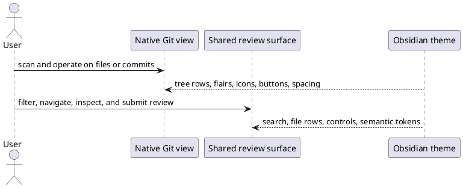

spec: task
name: "Native Git Surfaces"
inherits: project
tags: [architecture, sdd]
depends: [obsidian-appearance-parity]
estimate: 1d
test_command: pnpm vitest run -t "{selectors}" --reporter=junit --outputFile=.docwright/report.xml
test_report: .docwright/report.xml
---

## Intent

Finish the Git UI consolidation so local Changes, File History, Commit Log, and the shared review surface read as native Obsidian views. Theme behavior must come from Obsidian primitives instead of feature-owned card, row, status-dot, and button geometry.

## Current State

The review navigator and diff headers already use `tree-item*`, `nav-*`, `tree-item-flair`, `SearchComponent`, and `clickable-icon`. `sem impact` shows the remaining local surface is bounded to `GitChangesView`, `GitHistoryView`, and `GitLogView`, while `ReviewSurface` is shared by local review and GitHub PR detail. `sem impact --tests` found no direct structural coverage for the three remaining render methods. Their behavior works, but their rows and cards are still assembled and themed by Git-specific CSS.

## UX Shape

## Decisions

- Native means reusing existing Obsidian primitives: `tree-item*`, `nav-*`, `tree-item-flair`, `SearchComponent`, `clickable-icon`, `ItemView.addAction`, `SuggestModal`, `ConfirmationModal`, and `Notice`.
- Git-specific containers and semantic additions/deletions/status colors may remain; Git-specific row, card, button, and status-dot geometry may not.
- `@pierre/diffs` remains the diff renderer. Only its native host header and surrounding layout are in scope.
- Because `ReviewSurface` has both local Git and GitHub PR dependents, its native markup must preserve both consumers.
- The implementation adds no UI wrapper, framework, dependency, or speculative abstraction.
- Unreferenced `.review-commit-*` styling is deleted rather than preserved.

## Boundaries

### Allowed Changes

- `src/renderer/builtin/git/GitChangesView.ts`
- `src/renderer/builtin/git/GitHistoryView.ts`
- `src/renderer/builtin/git/GitLogView.ts`
- `src/renderer/builtin/git/review/GitNavView.ts`
- `src/renderer/builtin/git/review/ReviewSurface.ts`
- `src/renderer/builtin/git/review/checkControl.ts`
- `src/renderer/styles/product/git-changes.css`
- `src/renderer/styles/product/git-review.css`
- Git and GitHub web tests that prove these shared surfaces
- `docs/architecture/native-git-surfaces/`

### Forbidden

- No new dependency, rendering framework, or custom UI abstraction.
- No reimplementation of native tree rows, cards, buttons, search controls, or status dots.
- No Git service, model, command, authentication, or network behavior change.
- No theme-specific selector, fixed palette, or reach into Pierre shadow DOM.
- No weakening of the graduated `obsidian-appearance-parity` contract.

## Completion Criteria

Rule: native-local-changes

Scenario: Git Changes uses native rows and controls
Test:
Filter: renders Git Changes with native rows and controls
Level: component
Given a repository has staged and unstaged files
When Git Changes renders its sections and file entries
Then headings, file rows, status flairs, and actions use native Obsidian primitives while each diff remains operable

Scenario: Git Changes preserves unavailable and empty states
Test:
Filter: preserves Git Changes unavailable and empty states
Level: component
Given Git is unavailable, the vault is not a repository, or the working tree is clean
When Git Changes refreshes
Then it shows the corresponding native empty message without stale file rows or header actions

Rule: native-history-surfaces

Scenario: File History uses native commit rows and actions
Test:
Filter: renders File History with native rows and actions
Level: component
Given commits touch the selected file
When File History renders
Then each commit and its review, view, and compare actions use native rows and controls

Scenario: Commit Log uses native collapsible rows
Test:
Filter: renders Commit Log with native collapsible rows
Level: component
Given the repository has commit history
When a commit row is expanded
Then the native disclosure row lazily shows native changed-file rows with status and symmetric additions and deletions

Scenario: Commit Log preserves lazy failure and empty behavior
Test:
Filter: preserves Commit Log lazy and empty behavior
Level: component
Given the repository is unavailable, empty, or a selected commit file has no readable content
When Commit Log renders or expands the row
Then it shows the applicable empty state and loads detail at most once without a partial duplicate diff

Rule: native-shared-review

Scenario: Shared review sidebar uses native search and file rows
Test:
Filter: renders shared review navigation with native primitives
Level: component
Given GitHub PR detail embeds the shared review surface
When its file navigator renders and filters files
Then it uses native search, file icons, active and viewed row states, status flairs, and symmetric additions and deletions

Scenario: Local review remains externally navigated
Test:
Filter: keeps local review navigation external
Level: component
Given local Git review supplies its own right navigator and view-header actions
When the shared review surface renders
Then the embedded sidebar and toolbar stay hidden while activation and theme refresh continue to work

Rule: custom-ui-containment

Scenario: Git styles contain no reimplemented primitives
Test:
Filter: contains Git styling to native primitives
Level: contract
Given the Git product styles and view sources
When the native-surface contract is checked
Then custom card, row, button, status-dot, literal-color, and dead commit-composer styling is absent

## Out of Scope

- Replacing or restyling the Pierre diff renderer internals.
- Redesigning Git data services, commands, commit authoring, or repository workflows.
- Redesigning GitHub PR list and detail pages beyond their shared `ReviewSurface` controls.
- Adding avatars or remote author metadata.

## Open Questions

None.
