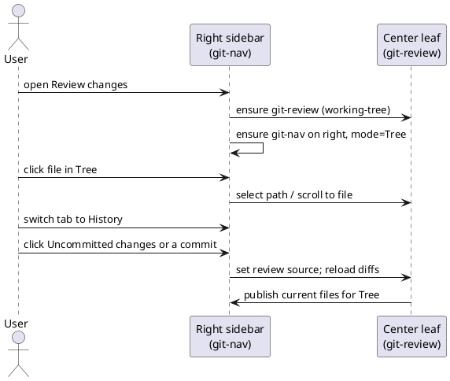

spec: task
name: "codiff-right-sidebar"
inherits: project
tags: [feature, git, codiff]
estimate: 1d
test_command: pnpm vitest run -t "{selectors}" --reporter=junit --outputFile=.docwright/report.xml
test_report: .docwright/report.xml
---

## Intent

Align the local review experience with nkzw-tech/codiff's navigation model —
**Tree** and **History** as the primary way to move through a change set —
but dock that navigation in **our right sidebar** (not codiff's left column),
so it stays one click away while the center pane owns the multi-file CodeView.

Walkthrough is intentionally excluded.

## Current State

- `GitReviewView` + `ReviewSurface` render a **left-of-main** flat file list
  inside the review pane (codiff-shaped CodeView, wrong shell).
- `GitLogView` / `GitHistoryView` are separate surfaces; History does not
  switch the active review source.
- Workspace already supports `ensureSideLeaf(type, "right")` (outline,
  backlinks pattern). Git has no right-docked navigator.
- `@pierre/diffs` is present; Tree can be a hierarchical path tree without
  requiring `@pierre/trees` for this goal.

## UX Shape

## Decisions

- **Reference**: codiff's sidebar modes are `tree | walkthrough | history`.
  We implement **`tree | history` only**. No walkthrough tab, agent, or
  narrative surface in this goal.
- **Placement**: codiff puts Tree/History on the **left** of its window.
  We put the same navigation in the workspace **right sidebar** via a
  dedicated view type `git-nav`, opened with `ensureSideLeaf(..., "right")`.
- **Center owns diffs**: `git-review` is the center (or main tab) CodeView,
  a pure diff surface (the commit composer lives in the nav Tree tab,
  codiff-style). When the right nav is active for a review session, the
  review surface **does not** render its internal file list (nav lives
  only on the right).
- **Tree**: hierarchical path tree of the **current review source's**
  changed files (folders collapsible), status decoration, filter, click
  selects/scrolls to that file in the center CodeView.
- **History**: paginated/local log list with a fixed first row
  **Uncommitted changes** (working-tree). Clicking a commit sets the
  review source to that commit and reloads the center. Clicking
  Uncommitted changes returns to working-tree. Author + date + short
  hash on commit rows.
- **Coordinator**: a small in-app session bridges nav ↔ review
  (source, files snapshot, selected path) without coupling to React
  trees across leaves. Workspace-friendly events are fine.
- **Open path**: "Review working tree changes" / review command opens
  (or focuses) center `git-review` **and** reveals right `git-nav`.
- Existing `GitChangesView` (SCM stage/discard/sync) stays; it is the
  operational SCM surface. This goal is the **codiff-class review shell**.
  `GitLogView` remains for now (narrow accordion log) but is no longer
  the primary History experience.

## Boundaries

### Allowed Changes

- apps/web/src/builtin/git/**
- apps/web/src/styles/product/git-review.css (and a nav stylesheet if split)
- tests/web/builtin/git/**
- package.json / lockfile only if a new dep is strictly required (prefer none)

### Forbidden

- Do not implement Walkthrough / agent narrative / codiff -w.
- Do not move Tree/History into the left dock (file explorer side).
- Do not delete GitChangesView's sync/stage/discard loop in this goal.
- Do not weaken existing git unit tests.

## Completion Criteria

### Rule: right-nav-shell — Tree and History live on the right

Scenario: open review docks navigator on the right
  Test: opens git-nav on the right beside git-review
  Given git is available for the vault
  When the user opens the working-tree review
  Then a git-review leaf is active in the main area and a git-nav leaf
  is ensured on the right sidebar with mode Tree

Scenario: modes are Tree and History only
  Test: offers only Tree and History modes
  Given the review center is open
  When its toolbar nav-mode toggle is used
  Then the toggle flips between Tree and History only (no Walkthrough)

### Rule: tree-nav — hierarchical files drive the center

Scenario: tree lists hierarchical changed paths
  Test: builds a hierarchical tree from changed paths
  Given review files at src/a.ts and src/lib/b.ts
  When the tree model is built
  Then a folder node src contains a.ts and a folder lib containing b.ts

Scenario: tree selection targets the center review
  Test: selecting a tree path requests center scroll
  Given git-nav is showing the current review files
  When the user selects path src/a.ts in the tree
  Then the coordinator selected path becomes src/a.ts

### Rule: history-source — History switches the review source

Scenario: uncommitted row is always first
  Test: history rows lead with uncommitted changes
  Given a non-empty local commit log
  When history rows are built
  Then the first row is the working-tree uncommitted entry
  and subsequent rows are commits

Scenario: picking a commit reloads review source
  Test: selecting a history commit sets commit source
  Given the navigator is in History mode
  When the user selects commit abcdef1
  Then the review source becomes kind commit with that ref

Scenario: picking uncommitted restores working tree
  Test: selecting uncommitted restores working-tree source
  Given the review source is a commit
  When the user selects Uncommitted changes
  Then the review source becomes working-tree

## Out of Scope

- Walkthrough / LLM narrative.
- @pierre/trees dependency (hierarchical tree without it is in scope).
- Merge conflict UI, stash, PR review tabs (github plugin).
- Replacing or deleting GitChangesView / GitLogView.
- Left-sidebar placement of Tree/History.

## Open Questions

None.
