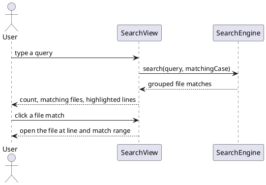

=== Contract ===

# Task Contract: file-search

## Intent

Complete the global file-search view so it behaves like Obsidian's search pane and
uses the existing `SearchEngine` as its single search backend. A user must be able
to enter a query, understand its state, inspect grouped file matches, and open a
match at the exact line and character range.

The reference is the locally extracted Obsidian `SearchView` in
`ref/obsidian/app.js` and its matching contracts in
`src/renderer/styles/features/search.css`; the implementation must use those
observed DOM/state names rather than inventing a parallel search surface.

## Current State

`src/renderer/builtin/SearchView.ts` currently renders a hand-built input, count,
and flat result list. It does not create Obsidian's `search-row`,
`search-result-container mod-global-search`, `search-results-info`, or
`search-params` structure; it also lacks match-case state, filter controls,
loading/empty states, result collapse, and sort state.

`src/renderer/search/SearchEngine.ts` already owns query parsing, file filtering,
content matching, custom operators, and line/section match ranges. Code files are
already included in its searchable extensions. This goal completes the view and
only extends the engine where a view option requires an observable backend
contract.

## UX Shape

## Must

- pnpm is the only package manager; a preinstall hook rejects npm and yarn.
- Fail fast on product paths: a missing configuration raises an explicit
- The full vitest suite is green before any merge.
- Keep the perf budget on the 20k-file vault: openFile median under 50ms
- Code stays name-agnostic: no product-name literal appears anywhere in the

## Must NOT

- Do not add a production dependency without a goal contract that adopts it.
- Do not weaken, skip, or delete an existing test to make a gate pass.
- Do not source a default from anywhere but the user's explicit configuration.

## Decisions

- One app, one package: the repo root is the single application package; its
- The native seam is ports-and-adapters: the shell fills the ports the renderer
- Dual-track plugin architecture: `builtin/` is the internal track and may use
- Kernel direction rule: `vault/`, `metadata/`, and `storage/` import only from
- Disk access stays in-process behind the `DataAdapter` seam in the renderer
- Unit tests are centralized under `tests/` (workspace member), mirroring
- The docs household is docwright goals under
- `SearchEngine` remains the only file-search backend; `SearchView` owns view
- The view uses the Obsidian-compatible DOM contracts already present in the
- Search state is persisted through `getState`/`setState` for query,
- Results are grouped by file, each group is collapsible, and result ordering is
- Every result click opens the existing Markdown or code-file view with the

## Boundaries

Allowed changes:

- `src/renderer/builtin/SearchView.ts`
- `src/renderer/search/SearchEngine.ts`
- `src/renderer/styles/features/search.css`
- `tests/web/builtin/SearchView.test.ts`
- `tests/web/search/SearchEngine.test.ts`
- `docs/features/file-search/spec.md`
- `docs/features/file-search/plan.md`
- `docs/features/file-search/tasks.md`
  Forbidden:
- Do not reimplement query parsing or file scanning inside `SearchView`.
- Do not add a second search result model or a second renderer for code files.
- Do not change the existing query operator semantics while completing the view.
- Do not guess at Obsidian behavior when the local extracted source or existing
- Do not change unrelated appearance, theme-market, Markdown renderer, or Git
  Out of scope:
- Replacing the already-completed `SearchEngine` parser with another Markdown
- New query operators, indexing architecture, or background search scheduling.
- The document-local find bar inside Markdown/code editors.
- Search-result copy modal details beyond preserving the existing search result

## Completion Criteria

Scenario: Happy path
Test:
Package: tests/web/builtin/SearchView.test.ts
Filter: SearchView renders Obsidian search structure and grouped matches
Level: integration
Given a vault contains matching Markdown and code files
When the user enters a query in the global Search view
Then the view renders the reference search-row/input structure, a result

Scenario: Search state and controls
Test:
Package: tests/web/builtin/SearchView.test.ts
Filter: SearchView persists matching case collapse and sort state
Level: integration
Given the global Search view is open with results
When the user toggles matching case, filter parameters, collapse-all, or sort
Then the visible results and `getState` reflect the selected option and a

Scenario: Exact result navigation
Test:
Package: tests/web/builtin/SearchView.test.ts
Filter: SearchView opens a result with the exact match range
Level: integration
Given a visible result contains a known line and match range
When the user clicks the result line
Then the target file opens with the existing line, matchStart, and matchEnd

Scenario: Empty and stale searches
Test:
Package: tests/web/builtin/SearchView.test.ts
Filter: SearchView handles empty queries and ignores stale results
Level: integration
Given a search is running or the query is empty
When the query is cleared or replaced before the previous search resolves
Then the view shows the empty/loading state as appropriate and never paints

Scenario: Invalid query
Test:
Package: tests/web/builtin/SearchView.test.ts
Filter: SearchView reports a search error without partial results
Level: integration
Given the user enters an unsupported or malformed search operator
When the global Search view starts the query
Then the view exposes the parser error and does not display stale results from

=== Codebase Context ===

(no matching files found)

=== Task Sketch ===

Group 1 (order 1):
Scenarios: - Happy path - Search state and controls - Exact result navigation - Empty and stale searches - Invalid query
Boundary paths: - src/renderer/builtin/SearchView.ts - src/renderer/search/SearchEngine.ts - src/renderer/styles/features/search.css - tests/web/builtin/SearchView.test.ts - tests/web/search/SearchEngine.test.ts - docs/features/file-search/spec.md - docs/features/file-search/plan.md - docs/features/file-search/tasks.md
Test selectors: - SearchView renders Obsidian search structure and grouped matches - SearchView persists matching case collapse and sort state - SearchView opens a result with the exact match range - SearchView handles empty queries and ignores stale results - SearchView reports a search error without partial results
