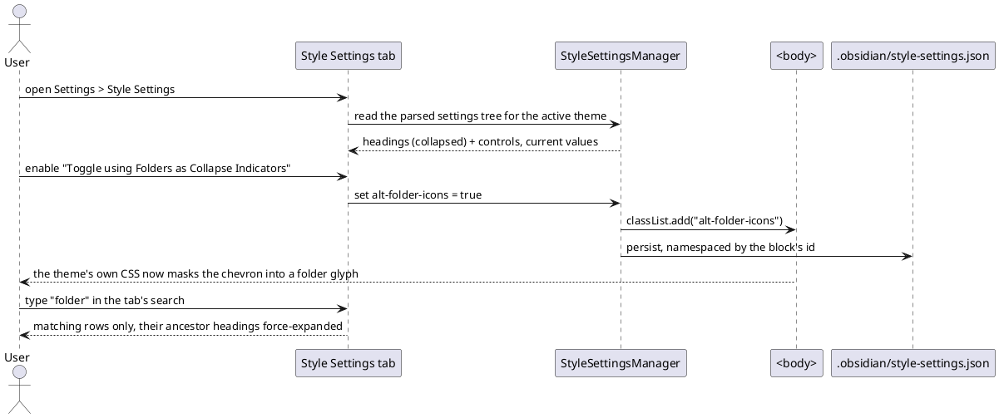

=== Contract ===

# Task Contract: theme style settings

## Intent
Give themes the ability to declare their own options and have the user turn
them on. A theme ships a `/* @settings */` YAML block; the app must parse it,
render controls, and apply the result — body classes for the class tier, CSS
custom properties for the variable tier. Without this, every theme's optional
feature is dead code: the Primary theme declares 517 settings, and today not
one of them can be reached. This is the mechanism the entire Obsidian theme
ecosystem depends on, and it is the reason a theme cannot currently replace
the file-explorer collapse chevron with its own folder glyph.

## Current State
The app loads a theme's CSS (`app/theme/ThemeManager.ts`,
`app/theme/CustomCss.ts`) and applies a small fixed set of body classes
(`app/app/BodyClasses.ts`: platform, ribbon, view-header, focus). Nothing reads
the `@settings` block; nothing writes theme-declared body classes or custom
properties. `AppearanceSettingTab` lists themes and snippets and stops there.

`yaml@2` is already a direct dependency and `parseYaml` is already exported
(`core/ApiUtils.ts:322`). `SettingGroup`, `ColorComponent`, `SliderComponent`,
`ToggleComponent`, `DropdownComponent` and `TextComponent` in `ui/Setting.ts`
are faithful ports of Obsidian's primitives. `Vault.readConfigJson` /
`writeConfigJson` exist, and `MetadataTypeManager` is the one builtin that
already owns a config json end to end.

The full evidence trail — the block's schema, the emission format proven from
the consuming CSS, the measured cascade experiment, and what Obsidian's own
settings architecture does and does not have — is in research.md and
learning-records/.

## UX Shape

## Must
- pnpm is the only package manager; a preinstall hook rejects npm and yarn.
- Fail fast on product paths: a missing configuration raises an explicit
- The full vitest suite is green before any merge.
- Keep the perf budget on the 20k-file vault: openFile median under 50ms
- Code stays name-agnostic: no product-name literal appears anywhere in the

## Must NOT
- Do not add a production dependency without a goal contract that adopts it.
- Do not weaken, skip, or delete an existing test to make a gate pass.
- Do not source a default from anywhere but the user's explicit configuration.

## Decisions
- One app, one package: the repo root is the single application package; its
- The native seam is ports-and-adapters: the shell fills the ports the renderer
- Dual-track plugin architecture: `builtin/` is the internal track and may use
- Kernel direction rule: `vault/`, `metadata/`, and `storage/` import only from
- Disk access stays in-process behind the `DataAdapter` seam in the renderer
- Unit tests are centralized under `tests/` (workspace member), mirroring
- The docs household is docwright goals under
- **The `@settings` block is parsed with `yaml@2` after expanding leading tabs
- **The class tier applies ids verbatim as body classes.** A `class-toggle`'s
- **The variable tier writes inline custom properties on `<body>`**, via
- **Emission format is dictated by the consuming CSS**: whole colour for
- **Values persist in `.obsidian/style-settings.json`**, namespaced by the
- **The tab is imperative**, built on `SettingGroup`, declaring
- **Collapsible headings and the alpha colour control are inventions, composed
- **Search is ancestor-aware**: a match force-expands its ancestor headings, and
- Both themes and CSS snippets are scanned for `@settings` blocks; both already

## Boundaries
Allowed changes:
- src/renderer/app/theme/**
- src/renderer/app/BodyClasses.ts
- src/renderer/builtin/StyleSettingsTab.ts
- src/renderer/builtin/SettingsRenderer.ts
- src/renderer/app/App.ts
- src/renderer/ui/Setting.ts
- src/renderer/styles/**
- src/renderer/index.ts
- tests/**
- docs/**
Forbidden:
- Do not reuse `metadata/Frontmatter.ts` to parse the block — it corrupts
- Do not emit the variable tier into a `<style>` element or under `:root` — it
- Do not namespace body classes by the block's id.
- Do not extend or build on `app/SettingTab.ts`'s declarative engine.
- Do not add a production dependency (`yaml` is already one).
- Do not collapse `readConfigJson`'s `null` and `undefined` into one branch.
- Do not weaken, skip or delete existing tests to make a gate pass.
- The product name must not appear as a literal in code or docs.
Out of scope:
- Repairing `app/SettingTab.ts`'s declarative engine (nested groups, the page
- Restoring a folder glyph in the file explorer by any route other than a theme
- Reading `@settings` from plugin-injected styles — those are not retained
- Giving popout windows the app stylesheet. Popouts currently render with no

## Completion Criteria

Rule: block-parsing — a real theme's block parses, whole
Scenario: the shipping theme's block parses to all 517 settings (critical)
  Test:
    Filter: parses a real theme settings block
  Given a theme CSS carrying an `@settings` block that mixes tab and 4-space
  When the block is extracted and parsed
  Then every setting is returned with its type, and no setting is merged,

Scenario: a malformed block is reported, not silently swallowed
  Test:
    Filter: surfaces a malformed settings block
  Given a theme whose `@settings` block is not valid YAML
  When it is parsed
  Then the theme still loads and the failure is surfaced rather than producing

Scenario: flat settings become a heading tree
  Test:
    Filter: builds a heading tree from flat settings
  Given a flat settings list containing headings at levels 1 to 4
  When the tree is built
  Then each setting belongs to the preceding heading and nesting follows the

Rule: class-tier — ids become body classes verbatim
Scenario: enabling a class-toggle adds its id as a body class (critical)
  Test:
    Filter: applies a class toggle as a body class
  Given a theme declaring a `class-toggle` with id "alt-folder-icons"
  When the user enables it
  Then `alt-folder-icons` is on the body element, un-namespaced, and removing

Scenario: a class-select applies the chosen option's value
  Test:
    Filter: applies the selected class option value
  Given a `class-select` whose options carry distinct values
  When the user picks an option
  Then that option's value is the body class and the previously selected

Rule: variable-tier — inline body properties, in the format the CSS expects
Scenario: a variable override beats the theme that declared the default (critical)
  Test:
    Filter: overrides a theme declared variable
  Given a theme declaring a custom property on the body element
  When the user sets that setting
  Then the resolved value wins, because the override is an inline custom

Scenario: each variable type emits the format its CSS consumes (critical)
  Test:
    Filter: emits each variable type in its consuming format
  Given settings of every variable type
  When their values are emitted
  Then an `hsl` themed colour emits a whole colour, an `rgb-values` themed

Scenario: switching light and dark applies the matching themed default
  Test:
    Filter: applies the themed default for the active scheme
  Given a themed colour with distinct light and dark defaults and no user value
  When the colour scheme changes
  Then the property carries the default for the active scheme

Rule: persistence — survives a restart, and never eats a corrupt file
Scenario: values persist across a reload, namespaced by the block (critical)
  Test:
    Filter: persists style settings across a reload
  Given the user has set values for a theme's settings
  When the app reloads
  Then the values are restored and applied, keyed by the declaring block's id

Scenario: a corrupt settings file is not overwritten with defaults (critical)
  Test:
    Filter: refuses to overwrite a corrupt settings file
  Given `.obsidian/style-settings.json` exists but cannot be parsed
  When style settings load
  Then the corrupt file is left intact and is not replaced by defaults

Scenario: saving does not re-enter its own reload
  Test:
    Filter: does not reload on its own save
  Given style settings are being saved
  When the config store emits its change event for that write
  Then the manager does not reload its own write

Rule: settings-surface — an Obsidian-shaped tab that can hold 517 rows
Scenario: the tab renders a control for every setting type
  Test:
    Filter: renders a control for every setting type
  Given a theme declaring each setting type
  When the Style Settings tab renders
  Then each type has its control, colours with an alpha channel carry both a

Scenario: headings collapse, and default to the state the theme declared
  Test:
    Filter: collapses headings as the theme declares
  Given a theme whose headings declare `collapsed: true`
  When the tab renders
  Then those sections are collapsed, and clicking a heading toggles it

Scenario: search reveals matches inside collapsed sections (critical)
  Test:
    Filter: reveals search matches inside collapsed sections
  Given a query matching a setting inside a collapsed section
  When the tab is searched
  Then the match is visible with its ancestor headings expanded, and headings

Scenario: the tab sits beside Appearance, not under Core plugins
  Test:
    Filter: places the style settings tab in options
  Given the settings surface
  When its tabs are laid out
  Then the Style Settings tab is in the options section

Rule: theme-lifecycle — follows the active theme without thrashing
Scenario: switching themes rebuilds the settings from the new theme (critical)
  Test:
    Filter: rebuilds style settings when the theme changes
  Given a theme with settings is active
  When the user switches to a different theme
  Then the previous theme's body classes and property overrides are removed and

Scenario: unrelated css-change traffic does not reparse the theme
  Test:
    Filter: ignores unrelated css change events
  Given the active theme is unchanged
  When a css-change fires for an accent colour, a snippet or a plugin style
  Then the theme's settings block is not reparsed

=== Codebase Context ===

Files (297):
  - docs/architecture.md
  - docs/architecture/native-git-surfaces/spec.md
  - docs/architecture/obsidian-appearance-parity/spec.md
  - docs/architecture/shared-tree-item-component/spec.md
  - docs/architecture/single-package-shell/spec.md
  - docs/architecture/vanilla-ui-consolidation/spec.md
  - docs/features/codiff-right-sidebar/spec.md
  - docs/features/local-git-surface-completion/learning-records/0001-scope-and-reference.md
  - docs/features/local-git-surface-completion/learning-records/0002-local-commits-view.md
  - docs/features/local-git-surface-completion/spec.md
  - docs/features/theme-style-settings/learning-records/0001-variable-override-carrier.md
  - docs/features/theme-style-settings/learning-records/0002-yaml-contract-and-emission.md
  - docs/features/theme-style-settings/learning-records/0003-persistence-and-lifecycle-hazards.md
  - docs/features/theme-style-settings/learning-records/0004-obsidian-settings-architecture.md
  - docs/features/theme-style-settings/research.md
  - docs/features/theme-style-settings/spec.md
  - docs/issues/large-vault-click-latency/spec.md
  - docs/issues/reading-view-stale-layout/spec.md
  - docs/learning/shared-tree-item-component/0001-adopt-shared-tree-component.md
  - docs/learning/shared-tree-item-component/0002-changes-sections-collapsible.md
  - docs/learning/shared-tree-item-component/0003-migrate-all-tree-sites.md
  - docs/learning/shared-tree-item-component/0004-tree-class-mirror-obsidian.md
  - docs/learning/shared-tree-item-component/0005-markdown-fold-follow-obsidian.md
  - docs/learning/shared-tree-item-component/research.md
  - docs/learning/single-package-shell/0001-layout-single-package.md
  - docs/learning/single-package-shell/0002-fitting-architecture.md
  - docs/project.spec.md
  - src/renderer/app/theme/AppearanceManager.ts
  - src/renderer/app/theme/CssSnippetManager.ts
  - src/renderer/app/theme/CustomCss.ts
  - src/renderer/app/theme/ThemeManager.ts
  - src/renderer/app/theme/obsidian-structure.css
  - src/renderer/app/theme/reconstruction/README.md
  - src/renderer/app/theme/reconstruction/icons.css
  - src/renderer/app/theme/reconstruction/index.css
  - src/renderer/app/theme/reconstruction/runtime.css
  - src/renderer/styles/base/platform-mobile.css
  - src/renderer/styles/base/reset.css
  - src/renderer/styles/base/rtl.css
  - src/renderer/styles/components/button-card.css
  - src/renderer/styles/components/checkbox.css
  - src/renderer/styles/components/clickable-icon.css
  - src/renderer/styles/components/collapse-indicator.css
  - src/renderer/styles/components/document-search.css
  - src/renderer/styles/components/dropdown.css
  - src/renderer/styles/components/menu.css
  - src/renderer/styles/components/modal-dialog.css
  - src/renderer/styles/components/notice.css
  - src/renderer/styles/components/popover-prompt-scrollbar.css
  - src/renderer/styles/components/suggestion-tabs.css
  - src/renderer/styles/components/text-input.css
  - src/renderer/styles/components/tooltip.css
  - src/renderer/styles/components/tree-item.css
  - src/renderer/styles/editor/callout.css
  - src/renderer/styles/editor/cm-cursor.css
  - src/renderer/styles/editor/cm6.css
  - src/renderer/styles/editor/code.css
  - src/renderer/styles/editor/embeds.css
  - src/renderer/styles/editor/footnotes.css
  - src/renderer/styles/editor/headings-hr.css
  - src/renderer/styles/editor/inline-title.css
  - src/renderer/styles/editor/links-tasks.css
  - src/renderer/styles/editor/lists.css
  - src/renderer/styles/editor/properties-metadata.css
  - src/renderer/styles/editor/reading-view.css
  - src/renderer/styles/editor/rendered-content.css
  - src/renderer/styles/editor/source-view.css
  - src/renderer/styles/editor/syntax-highlight.css
  - src/renderer/styles/editor/tables.css
  - src/renderer/styles/features/bookmarks-nav.css
  - src/renderer/styles/features/community-plugins.css
  - src/renderer/styles/features/file-recovery.css
  - src/renderer/styles/features/graph-outline.css
  - src/renderer/styles/features/pdf-view.css
  - src/renderer/styles/features/search.css
  - src/renderer/styles/features/settings-item.css
  - src/renderer/styles/features/tag-pane-canvas.css
  - src/renderer/styles/features/webviewer-workspaces.css
  - src/renderer/styles/index.css
  - src/renderer/styles/product/code-view.css
  - src/renderer/styles/product/diff.css
  - src/renderer/styles/product/explorer.css
  - src/renderer/styles/product/git-changes.css
  - src/renderer/styles/product/git-prs.css
  - src/renderer/styles/product/git-review.css
  - src/renderer/styles/product/starter.css
  - src/renderer/styles/product/terminal.css
  - src/renderer/styles/product/theme-market.css
  - src/renderer/styles/reveal/black.css
  - src/renderer/styles/reveal/reveal.css
  - src/renderer/styles/reveal/white.css
  - src/renderer/styles/tokens/tokens.css
  - src/renderer/styles/vendor/pdfjs-messagebar-dialog.css
  - src/renderer/styles/vendor/pdfjs-viewer.css
  - src/renderer/styles/workspace/app-container.css
  - src/renderer/styles/workspace/empty-state.css
  - src/renderer/styles/workspace/ribbon-sidedock.css
  - src/renderer/styles/workspace/splits-tabs.css
  - src/renderer/styles/workspace/starter-splash.css
  - src/renderer/styles/workspace/status-bar.css
  - src/renderer/styles/workspace/titlebar-frameless.css
  - src/renderer/styles/workspace/titlebar-vault-profile.css
  - src/renderer/styles/workspace/view-header.css
  - tests/architecture-tree-item.test.ts
  - tests/architecture.test.ts
  - tests/desktop/app-protocol.test.ts
  - tests/desktop/cli/CliDispatch.test.ts
  - tests/desktop/cli/CliServer.test.ts
  - tests/desktop/desktop-bridge.test.ts
  - tests/desktop/foundation-ipc.test.ts
  - tests/desktop/ipc.test.ts
  - tests/desktop/json-store.test.ts
  - tests/desktop/menu.test.ts
  - tests/desktop/obsidian-protocol.test.ts
  - tests/desktop/obsidian-url.test.ts
  - tests/desktop/preload.test.ts
  - tests/desktop/renderer-target.test.ts
  - tests/desktop/session-hardening.test.ts
  - tests/desktop/vault-registry.test.ts
  - tests/desktop/vault-windows.test.ts
  - tests/desktop/window-state.test.ts
  - tests/desktop/zsh-shim.test.ts
  - tests/e2e/app.spec.ts
  - tests/e2e/desktop/fixtures/electronApp.ts
  - tests/e2e/desktop/specs/01-launch.spec.ts
  - tests/e2e/desktop/specs/02-media.spec.ts
  - tests/e2e/desktop/specs/03-restart-persistence.spec.ts
  - tests/e2e/desktop/specs/04-starter.spec.ts
  - tests/e2e/desktop/specs/05-git.spec.ts
  - tests/e2e/perf/large-vault.spec.ts
  - tests/e2e/playwright.config.ts
  - tests/e2e/playwright.desktop.config.ts
  - tests/package.json
  - tests/web/app/AppCommands.test.ts
  - tests/web/app/AppLifecycle.test.ts
  - tests/web/app/AppProtocolHandlers.test.ts
  - tests/web/app/AppPublicApi.test.ts
  - tests/web/app/AttachmentImport.test.ts
  - tests/web/app/BodyClasses.test.ts
  - tests/web/app/FileManager.test.ts
  - tests/web/app/cli/Cli.test.ts
  - tests/web/app/cli/commands/coreMisc.test.ts
  - tests/web/app/cli/commands/fileWrites.test.ts
  - tests/web/app/cli/commands/graphLists.test.ts
  - tests/web/app/cli/commands/linksOutlineCli.test.ts
  - tests/web/app/cli/commands/metadata.test.ts
  - tests/web/app/cli/commands/navigation.test.ts
  - tests/web/app/cli/commands/searchCli.test.ts
  - tests/web/app/cli/commands/wordcountWebCli.test.ts
  - tests/web/app/cli/commands/workspacesCli.test.ts
  - tests/web/app/cli/registerCliCommands.test.ts
  - tests/web/app/commands/CommandManager.test.ts
  - tests/web/app/commands/CommandPalette.test.ts
  - tests/web/app/menus/MenuManager.test.ts
  - tests/web/app/protocol/UriRouter.test.ts
  - tests/web/app/starter/StarterScreen.test.ts
  - tests/web/app/theme/CssContract.test.ts
  - tests/web/app/theme/CustomCss.test.ts
  - tests/web/bootstrap.test.ts
  - tests/web/builtin/AppearanceSettingTab.test.ts
  - tests/web/builtin/Bookmarks.test.ts
  - tests/web/builtin/CommunityPluginMarketplaceModal.test.ts
  - tests/web/builtin/CommunityPluginsSettingTab.test.ts
  - tests/web/builtin/CorePluginsScope.test.ts
  - tests/web/builtin/FileExplorerView.test.ts
  - tests/web/builtin/FilesSettingTab.test.ts
  - tests/web/builtin/HotkeysSettingTab.test.ts
  - tests/web/builtin/LinkSuggest.test.ts
  - tests/web/builtin/MobileSettingTab.test.ts
  - tests/web/builtin/QuickSwitcher.test.ts
  - tests/web/builtin/SettingsDomParity.test.ts
  - tests/web/builtin/SlashCommand.test.ts
  - tests/web/builtin/TagSuggest.test.ts
  - tests/web/builtin/canvas/CanvasView.test.ts
  - tests/web/builtin/git/BranchSwitchModal.test.ts
  - tests/web/builtin/git/GitLogView.test.ts
  - tests/web/builtin/git/GitNativeViews.test.ts
  - tests/web/builtin/git/GitPlugin.test.ts
  - tests/web/builtin/git/GitService.test.ts
  - tests/web/builtin/git/GitThemeContract.test.ts
  - tests/web/builtin/git/review/GitNavView.test.ts
  - tests/web/builtin/git/review/GitReviewView.test.ts
  - tests/web/builtin/git/review/reviewModel.test.ts
  - tests/web/builtin/git/review/reviewNavModel.test.ts
  - tests/web/builtin/git/reviewSession.test.ts
  - tests/web/builtin/github/GitHubClient.test.ts
  - tests/web/builtin/github/GitHubWorkspace.test.tsx
  - tests/web/builtin/github/GitPrViews.test.tsx
  - tests/web/builtin/github/commits.test.ts
  - tests/web/builtin/github/extraApi.test.ts
  - tests/web/builtin/github/patchUtils.test.ts
  - tests/web/builtin/github/resolveRepository.test.ts
  - tests/web/builtin/graph/GraphDataEngine.test.ts
  - tests/web/builtin/graph/GraphSearchQuery.test.ts
  - tests/web/builtin/terminal/GhosttyTerminalRenderer.test.ts
  - tests/web/builtin/terminal/TerminalFocusScope.test.ts
  - tests/web/builtin/terminal/TerminalService.test.ts
  - tests/web/builtin/theme-market/ThemeMarket.test.ts
  - tests/web/builtin/webviewer/WebViewerAddressSuggest.test.ts
  - tests/web/builtin/webviewer/WebViewerElementAdapter.test.ts
  - tests/web/builtin/webviewer/WebViewerHistoryPersistence.test.ts
  - tests/web/builtin/webviewer/WebViewerReader.test.ts
  - tests/web/builtin/webviewer/WebViewerView.test.ts
  - tests/web/core/ApiUtils.test.ts
  - tests/web/core/Component.test.ts
  - tests/web/core/Events.test.ts
  - tests/web/dom/dom-helpers.test.ts
  - tests/web/dom/dom.test.ts
  - tests/web/editor/Editor.test.ts
  - tests/web/markdown/HtmlDropPreprocessor.test.ts
  - tests/web/markdown/HtmlToMarkdown.test.ts
  - tests/web/markdown/MarkdownDefaultProcessors.test.ts
  - tests/web/markdown/MarkdownPreviewRenderer.test.ts
  - tests/web/metadata/BlockCache.test.ts
  - tests/web/metadata/Frontmatter.test.ts
  - tests/web/metadata/LinkSuggestionManager.test.ts
  - tests/web/metadata/Linkpath.test.ts
  - tests/web/metadata/MetadataCache.test.ts
  - tests/web/platform/Platform.test.ts
  - tests/web/platform/desktop/DesktopMenu.test.ts
  - tests/web/platform/mobile/MobileBackButton.test.ts
  - tests/web/platform/mobile/MobileToolbar.test.ts
  - tests/web/platform/shell/ShellIntegration.test.ts
  - tests/web/plugin/CommunityPluginManagerParity.test.ts
  - tests/web/plugin/CorePluginConfig.test.ts
  - tests/web/plugin/InternalPluginWrapperParity.test.ts
  - tests/web/plugin/PluginApiParity.test.ts
  - tests/web/plugin/PluginDiscovery.test.ts
  - tests/web/plugin/PluginLifecycle.test.ts
  - tests/web/plugin/PluginMarketplace.test.ts
  - tests/web/plugin/PluginSettingTab.test.ts
  - tests/web/search/SearchEngine.test.ts
  - tests/web/setup.ts
  - tests/web/storage/AppConfig.test.ts
  - tests/web/storage/FileSystemJsonStoreAdapter.test.ts
  - tests/web/styles/FileTypeIconPalette.test.ts
  - tests/web/styles/StyleSystem.test.ts
  - tests/web/ui/Collapse.test.ts
  - tests/web/ui/Icon.test.ts
  - tests/web/ui/IconRegistryCompleteness.test.ts
  - tests/web/ui/Menu.test.ts
  - tests/web/ui/Modal.test.ts
  - tests/web/ui/ModalAudit.test.ts
  - tests/web/ui/Notice.test.ts
  - tests/web/ui/Popover.test.ts
  - tests/web/ui/Setting.test.ts
  - tests/web/ui/TreeItem.test.ts
  - tests/web/ui/drag/DragManager.test.ts
  - tests/web/ui/suggest/AbstractInputSuggest.test.ts
  - tests/web/ui/suggest/ComboboxSuggest.test.ts
  - tests/web/ui/suggest/EditorSuggest.test.ts
  - tests/web/ui/suggest/FileInputSuggest.test.ts
  - tests/web/ui/suggest/SuggestModal.test.ts
  - tests/web/vault/FileSystemAdapter.test.ts
  - tests/web/vault/TAbstractFile.test.ts
  - tests/web/vault/Vault.test.ts
  - tests/web/vault/VaultFileSystemAdapter.test.ts
  - tests/web/views/CodeFileView.test.ts
  - tests/web/views/CodeSymbols.test.ts
  - tests/web/views/DiffView.test.ts
  - tests/web/views/FileViewMenuParity.test.ts
  - tests/web/views/MarkdownViewApiParity.test.ts
  - tests/web/views/MarkdownViewDragDrop.test.ts
  - tests/web/views/MarkdownViewPropertyKeys.test.ts
  - tests/web/views/MarkdownViewPropertyTypes.test.ts
  - tests/web/views/ReadingViewResize.test.ts
  - tests/web/views/StreamMarkdownRenderer.test.ts
  - tests/web/views/Typewriter.test.ts
  - tests/web/views/ViewApiParity.test.ts
  - tests/web/views/properties/AliasPropertyWidget.test.ts
  - tests/web/views/properties/MetadataTypeManager.test.ts
  - tests/web/views/properties/MultiValuePropertyWidget.test.ts
  - tests/web/views/properties/PropertyLinkRenderer.test.ts
  - tests/web/views/properties/PropertyLinkSuggest.test.ts
  - tests/web/views/properties/TagPropertyWidget.test.ts
  - tests/web/views/workspace/VaultSwitcher.test.ts
  - tests/web/views/workspace/ViewRegistry.test.ts
  - tests/web/views/workspace/WorkspaceApiAliasesParity.test.ts
  - tests/web/views/workspace/WorkspaceBrowserHistoryParity.test.ts
  - tests/web/views/workspace/WorkspaceClearLayoutParity.test.ts
  - tests/web/views/workspace/WorkspaceDomStructure.test.ts
  - tests/web/views/workspace/WorkspaceEvents.test.ts
  - tests/web/views/workspace/WorkspaceHoverSourcesParity.test.ts
  - tests/web/views/workspace/WorkspaceIterateCodeMirrorsParity.test.ts
  - tests/web/views/workspace/WorkspaceLayoutPersistence.test.ts
  - tests/web/views/workspace/WorkspaceLayoutReadyParity.test.ts
  - tests/web/views/workspace/WorkspaceLeaf.test.ts
  - tests/web/views/workspace/WorkspaceLeafEventsParity.test.ts
  - tests/web/views/workspace/WorkspaceParentInsertParity.test.ts
  - tests/web/views/workspace/WorkspacePopoutAndTabList.test.ts
  - tests/web/views/workspace/WorkspacePublicApi.test.ts
  - tests/web/views/workspace/WorkspaceReadWorkspaceFileParity.test.ts
  - tests/web/views/workspace/WorkspaceRegisterUriHookParity.test.ts
  - tests/web/views/workspace/WorkspaceRibbon.test.ts
  - tests/web/views/workspace/WorkspaceSplit.test.ts
  - tests/web/views/workspace/WorkspaceTabHeaderMenu.test.ts
  - tests/web/views/workspace/WorkspaceTraversalParity.test.ts

=== Task Sketch ===

Group 1 (order 1):
  Scenarios:
    - the shipping theme's block parses to all 517 settings (critical)
    - a malformed block is reported, not silently swallowed
    - flat settings become a heading tree
    - enabling a class-toggle adds its id as a body class (critical)
    - a class-select applies the chosen option's value
    - a variable override beats the theme that declared the default (critical)
    - each variable type emits the format its CSS consumes (critical)
    - switching light and dark applies the matching themed default
    - values persist across a reload, namespaced by the block (critical)
    - a corrupt settings file is not overwritten with defaults (critical)
    - saving does not re-enter its own reload
    - the tab renders a control for every setting type
    - headings collapse, and default to the state the theme declared
    - search reveals matches inside collapsed sections (critical)
    - the tab sits beside Appearance, not under Core plugins
    - switching themes rebuilds the settings from the new theme (critical)
    - unrelated css-change traffic does not reparse the theme
  Boundary paths:
    - src/renderer/app/theme/**
    - src/renderer/app/BodyClasses.ts
    - src/renderer/builtin/StyleSettingsTab.ts
    - src/renderer/builtin/SettingsRenderer.ts
    - src/renderer/app/App.ts
    - src/renderer/ui/Setting.ts
    - src/renderer/styles/**
    - src/renderer/index.ts
    - tests/**
    - docs/**
  Test selectors:
    - parses a real theme settings block
    - surfaces a malformed settings block
    - builds a heading tree from flat settings
    - applies a class toggle as a body class
    - applies the selected class option value
    - overrides a theme declared variable
    - emits each variable type in its consuming format
    - applies the themed default for the active scheme
    - persists style settings across a reload
    - refuses to overwrite a corrupt settings file
    - does not reload on its own save
    - renders a control for every setting type
    - collapses headings as the theme declares
    - reveals search matches inside collapsed sections
    - places the style settings tab in options
    - rebuilds style settings when the theme changes
    - ignores unrelated css change events

=== Warnings ===

  - Allowed Changes path not found: src/renderer/builtin/StyleSettingsTab.ts (resolved to ./src/renderer/builtin/StyleSettingsTab.ts)
