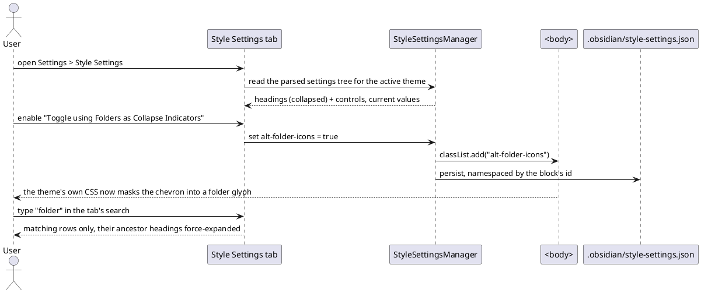

spec: task
name: "theme style settings"
inherits: project
tags: [feature, theme, settings]
estimate: 5d
test_command: pnpm vitest run -t "{selectors}" --reporter=junit --outputFile=.docwright/report.xml
test_report: .docwright/report.xml
---

## Intent

Give themes the ability to declare their own options and have the user turn
them on. A theme ships a `/* @settings */` YAML block; the app must parse it,
render controls, and apply the result — body classes for the class tier, CSS
custom properties for the variable tier. Without this, every theme's optional
feature is dead code: the Primary theme declares 517 settings, and today not
one of them can be reached. This is the mechanism the entire Obsidian theme
ecosystem depends on, and it is the reason a theme cannot currently replace
the file-explorer collapse chevron with its own folder glyph.

## Current State

The app loads a theme's CSS (`app/theme/ThemeManager.ts`,
`app/theme/CustomCss.ts`) and applies a small fixed set of body classes
(`app/app/BodyClasses.ts`: platform, ribbon, view-header, focus). Nothing reads
the `@settings` block; nothing writes theme-declared body classes or custom
properties. `AppearanceSettingTab` lists themes and snippets and stops there.

`yaml@2` is already a direct dependency and `parseYaml` is already exported
(`core/ApiUtils.ts:322`). `SettingGroup`, `ColorComponent`, `SliderComponent`,
`ToggleComponent`, `DropdownComponent` and `TextComponent` in `ui/Setting.ts`
are faithful ports of Obsidian's primitives. `Vault.readConfigJson` /
`writeConfigJson` exist, and `MetadataTypeManager` is the one builtin that
already owns a config json end to end.

The full evidence trail — the block's schema, the emission format proven from
the consuming CSS, the measured cascade experiment, and what Obsidian's own
settings architecture does and does not have — is in research.md and
learning-records/.

## UX Shape

## Decisions

- **The `@settings` block is parsed with `yaml@2` after expanding leading tabs
  to four spaces.** The real theme mixes tabs and 4-space indentation and
  `yaml@2` throws on tabs; expanding to two spaces also throws. The repo's
  hand-rolled frontmatter parser must not be reused — fed a real `class-select`
  it merged settings, collapsed `options` to its last entry, and reported
  `valid: true` (record 0002).
- **The class tier applies ids verbatim as body classes.** A `class-toggle`'s
  `id` *is* the class; a `class-select` applies the **selected option's
  `value`**, never its own `id`. No namespacing — the theme's CSS says
  `body.alt-folder-icons`, and a namespaced class would match no theme in the
  ecosystem (record 0002).
- **The variable tier writes inline custom properties on `<body>`**, via
  `document.body.style.setProperty`. Not a generated `<style>`, not `:root`.
  Every variable in this app is declared on `<body>`; custom properties inherit,
  and a declaration on the element itself always beats one inherited from its
  parent — so an `:root`/`<html>` override cannot win at any specificity or
  source order. Proven by a live cascade experiment. It also reaches popout
  windows for free through the existing body-style `MutationObserver`, whereas
  nothing copies `<style>` elements into a popout (record 0001).
- **Emission format is dictated by the consuming CSS**: whole colour for
  `format: hsl`; a **bare triplet** (`182, 175, 166`) for `format: rgb-values`,
  because app.css consumes those as `rgba(var(--canvas-color), 0.1)` and a
  wrapped `rgb(…)` would nest and drop the declaration; number + unit when
  `format` is `px`/`em` and a bare number otherwise; quoted when
  `quotes: true` (record 0002).
- **Values persist in `.obsidian/style-settings.json`**, namespaced by the
  declaring block's `id`, written whole-document from memory with an **mtime
  echo-guard** (`MetadataTypeManager`'s pattern) — `JsonStore.write` re-enters
  our own `raw` listener on every save. `readConfigJson`'s `null` (missing) and
  `undefined` (corrupt) are distinguished before any write, so a corrupt file is
  never silently overwritten with defaults (record 0003).
- **The corrupt-vs-missing distinction is pushed down into the JSON adapter.**
  `Vault.readJson` documents a tri-state (`null` = missing, `undefined` =
  corrupt), but that tri-state only ever existed on its non-jsonStore branch —
  which no real path takes. `App` always builds the vault *with* a jsonStore, so
  every real read goes through `FileSystemJsonStoreAdapter.readJson`, which
  caught the parse error and returned `null`. Corrupt was therefore
  indistinguishable from missing **in production**, and the whole-document write
  would have replaced a recoverable file with defaults — exactly the data loss
  record 0003 exists to prevent. The adapter now returns `undefined` on a parse
  failure and the `JsonStoreAdapter` interface widens to match. This reaches
  outside the feature's own tree deliberately: the alternative is a completion
  criterion that holds only against a fabricated test double and never against
  the desktop. Every other `readConfigJson` caller is audited for the widened
  return.
- **The tab is imperative**, built on `SettingGroup`, declaring
  `section = "options"` so it sits beside Appearance. Obsidian's setting tabs
  are 100% imperative and it has no declarative engine; the repo's
  `app/SettingTab.ts` engine is an invention that cannot nest groups and whose
  drill-down pages break below depth 2. Extending it would deepen the
  divergence, not close it (record 0004).
- **Collapsible headings and the alpha colour control are inventions, composed
  from Obsidian's own vocabulary.** Obsidian's settings have zero collapsible
  sections and zero alpha-capable colour controls, so neither can be copied, but
  the theme forces both. Collapse reuses the `.collapse-icon` + `right-triangle`
  idiom the nav panes already use; alpha is `ColorComponent` (hex) +
  `SliderComponent` (opacity) on one row. The 7 `opacity: false` colours get the
  picker alone (record 0004).
- **Search is ancestor-aware**: a match force-expands its ancestor headings, and
  a heading with no matching descendant hides. The tab owns its parsed tree, so
  this is expressible here and is not in the declarative engine, whose per-row
  state carries no identity, path or parent link (record 0004).
- Both themes and CSS snippets are scanned for `@settings` blocks; both already
  expose their `cssText`.

<!-- lint-ack: platform-decision-tag — Obsidian / decode-obsidian IS this goal's parity target and the primary source for every decision above, not an incidental platform mention -->

## Boundaries

### Allowed Changes

- src/renderer/app/theme/**
- src/renderer/app/BodyClasses.ts
- src/renderer/builtin/StyleSettingsTab.ts
- src/renderer/builtin/SettingsRenderer.ts
- src/renderer/app/App.ts
- src/renderer/app/AppLifecycle.ts
- src/renderer/ui/Setting.ts
- src/renderer/styles/**
- src/renderer/index.ts
- src/renderer/storage/**
- tests/**
- docs/**

### Forbidden

- Do not reuse `metadata/Frontmatter.ts` to parse the block — it corrupts
  nested lists of maps silently and reports success.
- Do not emit the variable tier into a `<style>` element or under `:root` — it
  cannot beat the theme, and it cannot reach popout windows.
- Do not namespace body classes by the block's id.
- Do not extend or build on `app/SettingTab.ts`'s declarative engine.
- Do not add a production dependency (`yaml` is already one).
- Do not collapse `readConfigJson`'s `null` and `undefined` into one branch.
- Do not weaken, skip or delete existing tests to make a gate pass.
- The product name must not appear as a literal in code or docs.

## Completion Criteria

<!-- lint-ack: bdd-implementation-detail-step — "each setting type" is the domain noun (the block declares nine types), not a typing gesture -->
<!-- lint-ack: bdd-implementation-detail-step — a heading's collapse toggle IS the behaviour under test; there is no non-UI way to state it -->

### Rule: block-parsing — a real theme's block parses, whole

Scenario: the shipping theme's block parses to all 517 settings (critical)
  Test: parses a real theme settings block
  Given a theme CSS carrying an `@settings` block that mixes tab and 4-space
  indentation
  When the block is extracted and parsed
  Then every setting is returned with its type, and no setting is merged,
  dropped or corrupted

Scenario: a malformed block is reported, not silently swallowed
  Test: surfaces a malformed settings block
  Given a theme whose `@settings` block is not valid YAML
  When it is parsed
  Then the theme still loads and the failure is surfaced rather than producing
  a partial or corrupted settings tree

Scenario: flat settings become a heading tree
  Test: builds a heading tree from flat settings
  Given a flat settings list containing headings at levels 1 to 4
  When the tree is built
  Then each setting belongs to the preceding heading and nesting follows the
  declared levels

### Rule: class-tier — ids become body classes verbatim

Scenario: enabling a class-toggle adds its id as a body class (critical)
  Test: applies a class toggle as a body class
  Given a theme declaring a `class-toggle` with id "alt-folder-icons"
  When the user enables it
  Then `alt-folder-icons` is on the body element, un-namespaced, and removing
  it takes the class off again

Scenario: a class-select applies the chosen option's value
  Test: applies the selected class option value
  Given a `class-select` whose options carry distinct values
  When the user picks an option
  Then that option's value is the body class and the previously selected
  option's class is gone — the select's own id never becomes a class

Scenario: a malformed class token from a theme cannot break the app (critical)
  Test: rejects a malformed theme class token
  Given a theme declaring a class setting whose id or option value is not a
  usable class token
  When style settings are applied
  Then that token is skipped, the remaining settings still apply, and startup
  is not interrupted — theme-authored ids are untrusted input

### Rule: variable-tier — inline body properties, in the format the CSS expects

Scenario: a variable override beats the theme that declared the default (critical)
  Test: overrides a theme declared variable
  Given a theme declaring a custom property on the body element
  When the user sets that setting
  Then the resolved value wins, because the override is an inline custom
  property on the body element

Scenario: each variable type emits the format its CSS consumes (critical)
  Test: emits each variable type in its consuming format
  Given settings of every variable type
  When their values are emitted
  Then an `hsl` themed colour emits a whole colour, an `rgb-values` themed
  colour emits a bare triplet with no `rgb()` wrapper, a number carries its
  `px`/`em` format and is bare without one, and a quoted text setting is quoted

Scenario: switching light and dark applies the matching themed default
  Test: applies the themed default for the active scheme
  Given a themed colour with distinct light and dark defaults and no user value
  When the colour scheme changes
  Then the property carries the default for the active scheme

### Rule: persistence — survives a restart, and never eats a corrupt file

Scenario: values persist across a reload, namespaced by the block (critical)
  Test: persists style settings across a reload
  Given the user has set values for a theme's settings
  When the app reloads
  Then the values are restored and applied, keyed by the declaring block's id

Scenario: a corrupt settings file is not overwritten with defaults (critical)
  Test: refuses to overwrite a corrupt settings file
  Given `.obsidian/style-settings.json` exists but cannot be parsed
  When style settings load
  Then the corrupt file is left intact and is not replaced by defaults

Scenario: saving does not re-enter its own reload
  Test: does not reload on its own save
  Given style settings are being saved
  When the config store emits its change event for that write
  Then the manager does not reload its own write

### Rule: settings-surface — an Obsidian-shaped tab that can hold 517 rows

Scenario: the tab renders a control for every setting type
  Test: renders a control for every setting type
  Given a theme declaring each setting type
  When the Style Settings tab renders
  Then each type has its control, colours with an alpha channel carry both a
  picker and an opacity slider, and colours without one carry the picker alone

Scenario: headings collapse, and default to the state the theme declared
  Test: collapses headings as the theme declares
  Given a theme whose headings declare `collapsed: true`
  When the tab renders
  Then those sections are collapsed, and clicking a heading toggles it

Scenario: search reveals matches inside collapsed sections (critical)
  Test: reveals search matches inside collapsed sections
  Given a query matching a setting inside a collapsed section
  When the tab is searched
  Then the match is visible with its ancestor headings expanded, and headings
  with no matching descendant are hidden

Scenario: the tab sits beside Appearance, not under Core plugins
  Test: places the style settings tab in options
  Given the settings surface
  When its tabs are laid out
  Then the Style Settings tab is in the options section

### Rule: theme-lifecycle — follows the active theme without thrashing

Scenario: switching themes rebuilds the settings from the new theme (critical)
  Test: rebuilds style settings when the theme changes
  Given a theme with settings is active
  When the user switches to a different theme
  Then the previous theme's body classes and property overrides are removed and
  the new theme's settings are parsed and applied

Scenario: unrelated css-change traffic does not reparse the theme
  Test: ignores unrelated css change events
  Given the active theme is unchanged
  When a css-change fires for an accent colour, a snippet or a plugin style
  Then the theme's settings block is not reparsed

## Out of Scope

- Repairing `app/SettingTab.ts`'s declarative engine (nested groups, the page
  stack, its missing CSS). It is unused by every builtin and is not this goal's
  problem; it is recorded as debt.
- Restoring a folder glyph in the file explorer by any route other than a theme
  turning one on. Without a theme the folder row keeps its native chevron.
- Reading `@settings` from plugin-injected styles — those are not retained
  anywhere and would require walking `document.head`.
- Giving popout windows the app stylesheet. Popouts currently render with no
  CSS at all; that is a separate, pre-existing gap. The variable tier reaches
  them anyway because inline body properties are already synced.

## Open Questions

None.
