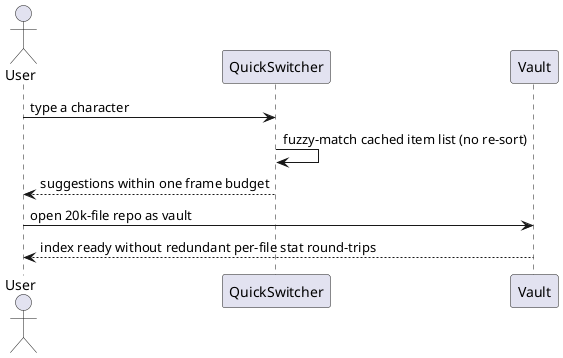

spec: task
name: "large vault click latency"
tags: [issue, sdd, performance]
test_command: pnpm vitest run -t "{selectors}" --reporter=junit --outputFile=.agent-spec/report.xml
test_report: .agent-spec/report.xml
---

## Intent

Opening a code repository (~20k files) as a vault makes every file
interaction sluggish. Measured on the committed harness
(`e2e/perf/large-vault.spec.ts`, `ARKLOOP_PERF=1`, 20k junk files):

- openFile via `openLinkText`: median **1217ms** (44ms with the file
  explorer detached — the explorer rerender is ~96% and is owned by the
  parallel `perf-vault-optimize` work, out of scope here)
- Quick switcher: **~200ms per keystroke** — pure switcher cost,
  measured with the explorer detached
- vault ready: ~3.0s, inflated by up to three `stat` round-trips per
  file on the load/index path (adapter `readEntry`, Vault
  `refreshFileStat`, MetadataCache `getVaultFileStat`)

This goal removes the large-vault costs that remain after the explorer
fix: per-keystroke full-vault rescans in the quick switcher, and the
redundant per-file stat storm during vault load / initial indexing.

## Current State

### Impact

On a 20k-file vault, typing in the quick switcher costs ~200ms per
keystroke (sorting and re-enumerating all files on every input event),
and first open floods the adapter with ~40k redundant stat calls on top
of the ~20k the directory walk already performed.

### Suspected Root Cause

- `QuickSwitcherModal.getItems()` runs `vault.getFiles()` + filter +
  locale-aware sort of all 20k paths on **every keystroke**
  (`SuggestModal.onInput -> getSuggestions -> getItems`), only to render
  at most 20 rows.
- `Vault.handleAdapterCreate` calls `refreshFileStat` (one
  `adapter.stat` per file) even though the adapter's reconcile already
  read the entry's stat moments earlier; `MetadataCache
  .computeFileMetadataAsync` then stats the same file a third time via
  `getVaultFileStat` instead of using the in-memory `TFile.stat`.

## UX Shape

## Decisions

### Fix Plan

- Quick switcher: compute the item list once per modal open and reuse it
  for every keystroke; keep fuzzy matching per keystroke (that part is
  query-dependent).
- Stat de-duplication: `MetadataCache.getVaultFileStat` uses the
  in-memory `TFile.stat` when it carries a real mtime and only falls
  back to `adapter.stat` otherwise; the adapter create/change events
  carry the stat it already read so `Vault` can set `file.stat` without
  issuing a second stat.

### Validation

- Unit tests pin the new behavior (item list computed once per open;
  no adapter stat when `TFile.stat` is fresh).
- The committed perf harness (`ARKLOOP_PERF=1`) documents before/after
  medians in this spec; it stays out of the default gate because a 20k
  file seed is too slow for CI.
- Measured result (20k junk files): switcher keystrokes went from
  171–226ms per key to 185ms on the first key (one-time enumerate+sort)
  and ~33–45ms after — ~5–6x on the steady state. openFile /
  explorerClick medians are unchanged as expected (explorer rerender,
  out of scope).

## Boundaries

### Allowed Changes

- src/builtin/QuickSwitcher.ts
- src/suggest/SuggestModal.ts
- src/metadata/MetadataCache.ts
- src/vault/Vault.ts
- src/vault/FileSystemAdapter.ts
- e2e/perf/large-vault.spec.ts
- matching test files

### Forbidden

- No changes to FileExplorerView rendering (owned by the parallel
  perf-vault-optimize work)
- No new dependencies
- No behavior change to suggestion ranking or vault event semantics

## Completion Criteria

Scenario: Quick switcher reuses its item list across keystrokes
  Test:
    Package: src/builtin/QuickSwitcher.test.ts
    Filter: quick switcher computes its item list once per open
    Level: unit
  Given a vault with many files and an open quick switcher modal
  When the user types several characters
  Then the file list is enumerated and sorted only once per modal open
  And each keystroke only fuzzy-matches against the cached list

Scenario: Metadata indexing reuses in-memory file stats
  Test:
    Package: src/metadata/MetadataCache.test.ts
    Filter: metadata indexing reuses in-memory file stats
    Level: unit
  Given a loaded vault whose TFile entries carry fresh stat data
  When the metadata cache indexes those files
  Then it does not issue adapter stat calls for files with fresh stats

Scenario: Metadata indexing falls back to adapter stat when in-memory stat is unknown
  Test:
    Package: src/metadata/MetadataCache.test.ts
    Filter: metadata indexing falls back to adapter stat when in-memory stat is unknown
    Level: unit
  Given a TFile whose stat carries no real mtime
  When the metadata cache validates its cache entry
  Then it queries the adapter for the real stat instead of trusting the placeholder

Scenario: Vault applies adapter-provided stats without re-statting
  Test:
    Package: src/vault/Vault.test.ts
    Filter: vault applies adapter-provided stats without re-statting
    Level: unit
  Given the adapter reconciles a file and already holds its stat entry
  When the vault materializes the TFile for the create event
  Then the TFile stat comes from the event payload
  And no additional adapter stat round-trip is issued for that file

## Out of Scope

- File explorer rendering costs (parallel perf-vault-optimize worktree)
- Adapter directory skip-lists and reconcile concurrency (same parallel
  worktree)
- Content search performance

## Open Questions

None.
