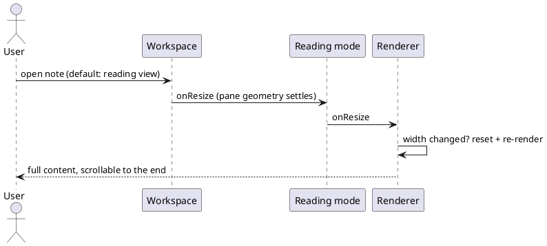

=== Contract ===

# Task Contract: reading view stale layout

## Intent
A note opened in reading view must show its full content and scroll to the
end. Since preview became the default mode, notes render only their first
block; the scrollbar exists but scrolling reveals blank space. An earlier
CSS-level fix (reading-view height pin) addressed the scroll box, which was
already healthy, and left the real defect in place.

## Current State
### Impact

Every note opened in the default reading view is effectively truncated to
its first visible block. Measured live: an 835-character note produced a
19065px sizer with one section materialized; an H1 was recorded as 559px
tall and one list section as 11218px.

### Root Cause (confirmed, code-to-code against the reference renderer)

Section heights are stamped from `el.offsetHeight` during the first render,
which can run while the pane still has transient geometry (zero/narrow
width wraps text one word per line, inflating every measurement). The
reference implementation heals this on resize; our port severed all three
heal paths:

1. The reading mode's `onResize()` is an empty stub, so the leaf's
   ResizeObserver signal never reaches `MarkdownPreviewRenderer.onResize()`.
2. Our `renderer.onResize()` only refreshes the virtual display; the
   reference re-renders (`resetCompute()` on every section + `queueRender()`)
   whenever the width actually changed, which re-stamps every height at the
   settled geometry.
3. With no re-render ever happening, the layout estimator keeps trusting
   the stale heights and `viewportHeight` stays 0 forever.

## UX Shape

## Must
- pnpm is the only package manager; a preinstall hook rejects npm and yarn.
- Fail fast on product paths: a missing configuration raises an explicit
- The full vitest suite is green before any merge.
- Keep the perf budget on the 20k-file vault: openFile median under 50ms
- Code stays name-agnostic: no product-name literal appears anywhere in the

## Must NOT
- Do not add a production dependency without a goal contract that adopts it.
- Do not weaken, skip, or delete an existing test to make a gate pass.
- Do not source a default from anywhere but the user's explicit configuration.

## Decisions
- The workspace is three pnpm app packages — `@app/desktop`, `@app/web`,
- Dual-track plugin architecture: `builtin/` is the internal track and may
- Kernel direction rule: `vault/`, `metadata/`, and `storage/` import only
- Disk access stays behind the `VaultAdapter` seam inside the web app.
- Unit tests are centralized under `tests/` (workspace member), mirroring
- The docs household is docwright goals under
- Forward the signal: `MarkdownReadingMode.onResize()` calls
- Align `MarkdownPreviewRenderer.onResize()` with the reference semantics:
- Unify width bookkeeping on `offsetWidth` (the render pass currently
- No estimator change: a re-render re-stamps every section height at the
- The two mechanism halves (signal forwarding, width-change re-render) are
- Real-app proof at the gate: desktop run with a long note opened in

## Boundaries
Allowed changes:
- apps/web/src/views/MarkdownView.ts
- apps/web/src/markdown/MarkdownPreviewRenderer.ts
- tests/web/**
- tests/e2e/desktop/**
Forbidden:
- Do not touch apps/web/src/builtin/** (a concurrent goal owns it).
- Do not change virtual-display estimation semantics beyond reference
- Do not add dependencies or weaken existing tests.
Out of scope:
- Section recycling (the reference reuses rendered sections on re-render;
- Edit-mode resize path (already wired and working).
- The reading-view height CSS added by the earlier attempt (harmless,

## Completion Criteria
Scenario: resize reaches the renderer in reading mode
  Test:
    Filter: forwards resize to the preview renderer
  Given a markdown view in reading mode
  When the view receives onResize
  Then the preview renderer's onResize runs

Scenario: width change invalidates and re-renders
  Test:
    Filter: re-renders when the preview width changes
  Given a renderer whose sections were measured at a stale width
  When onResize runs with a different width
  Then every section's compute flag resets and a re-render is queued

Scenario: unchanged width only refreshes the virtual window
  Test:
    Filter: refreshes the virtual display when width is unchanged
  Given a renderer already rendered at the current width
  When onResize runs at the same width
  Then no re-render is queued and the virtual display is refreshed

=== Codebase Context ===

Files (172):
  - tests/e2e/desktop/fixtures/electronApp.ts
  - tests/e2e/desktop/specs/01-launch.spec.ts
  - tests/e2e/desktop/specs/02-media.spec.ts
  - tests/e2e/desktop/specs/03-restart-persistence.spec.ts
  - tests/e2e/desktop/specs/04-starter.spec.ts
  - tests/e2e/desktop/specs/05-git.spec.ts
  - tests/web/app/AppCommands.test.ts
  - tests/web/app/AppLifecycle.test.ts
  - tests/web/app/AppProtocolHandlers.test.ts
  - tests/web/app/AppPublicApi.test.ts
  - tests/web/app/AttachmentImport.test.ts
  - tests/web/app/BodyClasses.test.ts
  - tests/web/app/FileManager.test.ts
  - tests/web/app/cli/Cli.test.ts
  - tests/web/app/cli/commands/coreMisc.test.ts
  - tests/web/app/cli/commands/fileWrites.test.ts
  - tests/web/app/cli/commands/graphLists.test.ts
  - tests/web/app/cli/commands/linksOutlineCli.test.ts
  - tests/web/app/cli/commands/metadata.test.ts
  - tests/web/app/cli/commands/navigation.test.ts
  - tests/web/app/cli/commands/searchCli.test.ts
  - tests/web/app/cli/commands/wordcountWebCli.test.ts
  - tests/web/app/cli/commands/workspacesCli.test.ts
  - tests/web/app/cli/registerCliCommands.test.ts
  - tests/web/app/commands/CommandManager.test.ts
  - tests/web/app/commands/CommandPalette.test.ts
  - tests/web/app/menus/MenuManager.test.ts
  - tests/web/app/protocol/UriRouter.test.ts
  - tests/web/app/starter/StarterScreen.test.ts
  - tests/web/app/theme/CssContract.test.ts
  - tests/web/app/theme/CustomCss.test.ts
  - tests/web/bootstrap.test.ts
  - tests/web/builtin/Bookmarks.test.ts
  - tests/web/builtin/CommunityPluginMarketplaceModal.test.ts
  - tests/web/builtin/CommunityPluginsSettingTab.test.ts
  - tests/web/builtin/CorePluginsScope.test.ts
  - tests/web/builtin/FileExplorerView.test.ts
  - tests/web/builtin/FilesSettingTab.test.ts
  - tests/web/builtin/HotkeysSettingTab.test.ts
  - tests/web/builtin/LinkSuggest.test.ts
  - tests/web/builtin/MobileSettingTab.test.ts
  - tests/web/builtin/QuickSwitcher.test.ts
  - tests/web/builtin/SettingsDomParity.test.ts
  - tests/web/builtin/SlashCommand.test.ts
  - tests/web/builtin/TagSuggest.test.ts
  - tests/web/builtin/agent/Agent.test.ts
  - tests/web/builtin/agent/AgentBuiltin.test.ts
  - tests/web/builtin/agent/AgentPropertiesView.test.ts
  - tests/web/builtin/agent/AgentQueue.test.ts
  - tests/web/builtin/agent/AgentView.test.ts
  - tests/web/builtin/agent/ChatComposer.test.ts
  - tests/web/builtin/agent/ChatComposerPaste.test.ts
  - tests/web/builtin/agent/ChatE2E.test.ts
  - tests/web/builtin/agent/ChatMessageListTimeline.test.ts
  - tests/web/builtin/agent/ChatToolCards.test.ts
  - tests/web/builtin/agent/MultiAgentView.test.ts
  - tests/web/builtin/canvas/CanvasView.test.ts
  - tests/web/builtin/git/BranchSwitchModal.test.ts
  - tests/web/builtin/git/GitLogView.test.ts
  - tests/web/builtin/git/GitPlugin.test.ts
  - tests/web/builtin/git/GitService.test.ts
  - tests/web/builtin/git/review/GitReviewView.test.tsx
  - tests/web/builtin/git/review/reviewModel.test.ts
  - tests/web/builtin/github/GitHubClient.test.ts
  - tests/web/builtin/github/GitHubWorkspace.test.tsx
  - tests/web/builtin/github/GitPrViews.test.tsx
  - tests/web/builtin/github/commits.test.ts
  - tests/web/builtin/github/extraApi.test.ts
  - tests/web/builtin/github/patchUtils.test.ts
  - tests/web/builtin/github/resolveRepository.test.ts
  - tests/web/builtin/graph/GraphDataEngine.test.ts
  - tests/web/builtin/graph/GraphSearchQuery.test.ts
  - tests/web/builtin/terminal/GhosttyTerminalRenderer.test.ts
  - tests/web/builtin/terminal/TerminalFocusScope.test.ts
  - tests/web/builtin/terminal/TerminalService.test.ts
  - tests/web/builtin/theme-market/ThemeMarket.test.ts
  - tests/web/builtin/webviewer/WebViewerAddressSuggest.test.ts
  - tests/web/builtin/webviewer/WebViewerElementAdapter.test.ts
  - tests/web/builtin/webviewer/WebViewerHistoryPersistence.test.ts
  - tests/web/builtin/webviewer/WebViewerReader.test.ts
  - tests/web/builtin/webviewer/WebViewerView.test.ts
  - tests/web/core/ApiUtils.test.ts
  - tests/web/core/Component.test.ts
  - tests/web/core/Events.test.ts
  - tests/web/dom/dom-helpers.test.ts
  - tests/web/dom/dom.test.ts
  - tests/web/editor/Editor.test.ts
  - tests/web/markdown/HtmlDropPreprocessor.test.ts
  - tests/web/markdown/HtmlToMarkdown.test.ts
  - tests/web/markdown/MarkdownDefaultProcessors.test.ts
  - tests/web/markdown/MarkdownPreviewRenderer.test.ts
  - tests/web/metadata/BlockCache.test.ts
  - tests/web/metadata/Frontmatter.test.ts
  - tests/web/metadata/LinkSuggestionManager.test.ts
  - tests/web/metadata/Linkpath.test.ts
  - tests/web/metadata/MetadataCache.test.ts
  - tests/web/platform/Platform.test.ts
  - tests/web/platform/desktop/DesktopMenu.test.ts
  - tests/web/platform/mobile/MobileBackButton.test.ts
  - tests/web/platform/mobile/MobileToolbar.test.ts
  - tests/web/platform/shell/ShellIntegration.test.ts
  - tests/web/plugin/CommunityPluginManagerParity.test.ts
  - tests/web/plugin/CorePluginConfig.test.ts
  - tests/web/plugin/InternalPluginWrapperParity.test.ts
  - tests/web/plugin/PluginApiParity.test.ts
  - tests/web/plugin/PluginDiscovery.test.ts
  - tests/web/plugin/PluginLifecycle.test.ts
  - tests/web/plugin/PluginMarketplace.test.ts
  - tests/web/plugin/PluginSettingTab.test.ts
  - tests/web/search/SearchEngine.test.ts
  - tests/web/setup.ts
  - tests/web/storage/AppConfig.test.ts
  - tests/web/storage/FileSystemJsonStoreAdapter.test.ts
  - tests/web/styles/StyleSystem.test.ts
  - tests/web/ui/Collapse.test.ts
  - tests/web/ui/Icon.test.ts
  - tests/web/ui/IconRegistryCompleteness.test.ts
  - tests/web/ui/Menu.test.ts
  - tests/web/ui/Modal.test.ts
  - tests/web/ui/ModalAudit.test.ts
  - tests/web/ui/Notice.test.ts
  - tests/web/ui/Popover.test.ts
  - tests/web/ui/Setting.test.ts
  - tests/web/ui/drag/DragManager.test.ts
  - tests/web/ui/suggest/AbstractInputSuggest.test.ts
  - tests/web/ui/suggest/ComboboxSuggest.test.ts
  - tests/web/ui/suggest/EditorSuggest.test.ts
  - tests/web/ui/suggest/FileInputSuggest.test.ts
  - tests/web/ui/suggest/SuggestModal.test.ts
  - tests/web/vault/FileSystemAdapter.test.ts
  - tests/web/vault/TAbstractFile.test.ts
  - tests/web/vault/Vault.test.ts
  - tests/web/vault/VaultFileSystemAdapter.test.ts
  - tests/web/views/CodeFileView.test.ts
  - tests/web/views/CodeSymbols.test.ts
  - tests/web/views/DiffView.test.ts
  - tests/web/views/FileViewMenuParity.test.ts
  - tests/web/views/MarkdownViewApiParity.test.ts
  - tests/web/views/MarkdownViewDragDrop.test.ts
  - tests/web/views/MarkdownViewPropertyKeys.test.ts
  - tests/web/views/MarkdownViewPropertyTypes.test.ts
  - tests/web/views/StreamMarkdownRenderer.test.ts
  - tests/web/views/Typewriter.test.ts
  - tests/web/views/ViewApiParity.test.ts
  - tests/web/views/properties/AliasPropertyWidget.test.ts
  - tests/web/views/properties/MetadataTypeManager.test.ts
  - tests/web/views/properties/MultiValuePropertyWidget.test.ts
  - tests/web/views/properties/PropertyLinkRenderer.test.ts
  - tests/web/views/properties/PropertyLinkSuggest.test.ts
  - tests/web/views/properties/TagPropertyWidget.test.ts
  - tests/web/views/workspace/VaultSwitcher.test.ts
  - tests/web/views/workspace/ViewRegistry.test.ts
  - tests/web/views/workspace/WorkspaceApiAliasesParity.test.ts
  - tests/web/views/workspace/WorkspaceBrowserHistoryParity.test.ts
  - tests/web/views/workspace/WorkspaceClearLayoutParity.test.ts
  - tests/web/views/workspace/WorkspaceDomStructure.test.ts
  - tests/web/views/workspace/WorkspaceEvents.test.ts
  - tests/web/views/workspace/WorkspaceHoverSourcesParity.test.ts
  - tests/web/views/workspace/WorkspaceIterateCodeMirrorsParity.test.ts
  - tests/web/views/workspace/WorkspaceLayoutPersistence.test.ts
  - tests/web/views/workspace/WorkspaceLayoutReadyParity.test.ts
  - tests/web/views/workspace/WorkspaceLeaf.test.ts
  - tests/web/views/workspace/WorkspaceLeafEventsParity.test.ts
  - tests/web/views/workspace/WorkspaceParentInsertParity.test.ts
  - tests/web/views/workspace/WorkspacePopoutAndTabList.test.ts
  - tests/web/views/workspace/WorkspacePublicApi.test.ts
  - tests/web/views/workspace/WorkspaceReadWorkspaceFileParity.test.ts
  - tests/web/views/workspace/WorkspaceRegisterUriHookParity.test.ts
  - tests/web/views/workspace/WorkspaceRibbon.test.ts
  - tests/web/views/workspace/WorkspaceSplit.test.ts
  - tests/web/views/workspace/WorkspaceTabHeaderMenu.test.ts
  - tests/web/views/workspace/WorkspaceTraversalParity.test.ts

=== Task Sketch ===

Group 1 (order 1):
  Scenarios:
    - resize reaches the renderer in reading mode
    - width change invalidates and re-renders
    - unchanged width only refreshes the virtual window
  Boundary paths:
    - apps/web/src/views/MarkdownView.ts
    - apps/web/src/markdown/MarkdownPreviewRenderer.ts
    - tests/web/**
    - tests/e2e/desktop/**
  Test selectors:
    - forwards resize to the preview renderer
    - re-renders when the preview width changes
    - refreshes the virtual display when width is unchanged

