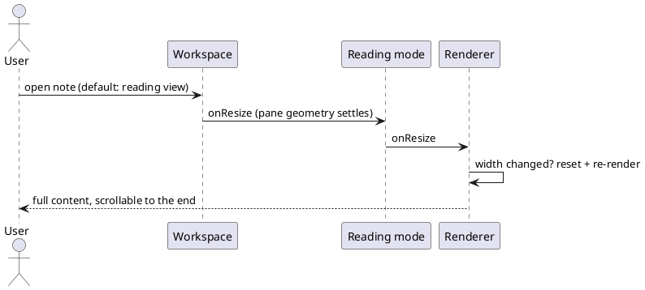

spec: task
name: "reading view stale layout"
inherits: project
tags: [issue, sdd]
estimate: 0.25d
test_command: pnpm vitest run -t "{selectors}" --reporter=junit --outputFile=.docwright/report.xml
test_report: .docwright/report.xml
---

## Intent

A note opened in reading view must show its full content and scroll to the
end. Since preview became the default mode, notes render only their first
block; the scrollbar exists but scrolling reveals blank space. An earlier
CSS-level fix (reading-view height pin) addressed the scroll box, which was
already healthy, and left the real defect in place.

## Current State

### Impact

Every note opened in the default reading view is effectively truncated to
its first visible block. Measured live: an 835-character note produced a
19065px sizer with one section materialized; an H1 was recorded as 559px
tall and one list section as 11218px.

### Root Cause (confirmed, code-to-code against the reference renderer)

Section heights are stamped from `el.offsetHeight` during the first render,
which can run while the pane still has transient geometry (zero/narrow
width wraps text one word per line, inflating every measurement). The
reference implementation heals this on resize; our port severed all three
heal paths:

1. The reading mode's `onResize()` is an empty stub, so the leaf's
   ResizeObserver signal never reaches `MarkdownPreviewRenderer.onResize()`.
2. Our `renderer.onResize()` only refreshes the virtual display; the
   reference re-renders (`resetCompute()` on every section + `queueRender()`)
   whenever the width actually changed, which re-stamps every height at the
   settled geometry.
3. With no re-render ever happening, the layout estimator keeps trusting
   the stale heights and `viewportHeight` stays 0 forever.

## UX Shape

## Decisions

### Fix Plan

- Forward the signal: `MarkdownReadingMode.onResize()` calls
  `this.renderer.onResize()` (mirrors the reference view).
- Align `MarkdownPreviewRenderer.onResize()` with the reference semantics:
  always refresh `viewportHeight`; when `offsetWidth` differs from
  `renderedWidth`, store it, `resetCompute()` every section and
  `queueRender()`; otherwise just `updateVirtualDisplay()`.
- Unify width bookkeeping on `offsetWidth` (the render pass currently
  stores `clientWidth`, an off-by-scrollbar mismatch that would force one
  spurious re-render per resize).
- No estimator change: a re-render re-stamps every section height at the
  current geometry, which restores the reference invariant that stored
  heights are never from a dead layout.

### Validation

- The two mechanism halves (signal forwarding, width-change re-render) are
  bound to unit scenarios below.
- Real-app proof at the gate: desktop run with a long note opened in
  reading view, scrolled to its last block.

## Boundaries

### Allowed Changes

- apps/web/src/views/MarkdownView.ts
- apps/web/src/markdown/MarkdownPreviewRenderer.ts
- tests/web/**
- tests/e2e/desktop/**

### Forbidden

- Do not touch apps/web/src/builtin/** (a concurrent goal owns it).
- Do not change virtual-display estimation semantics beyond reference
  parity.
- Do not add dependencies or weaken existing tests.

## Completion Criteria

Scenario: resize reaches the renderer in reading mode
Test: forwards resize to the preview renderer
Given a markdown view in reading mode
When the view receives onResize
Then the preview renderer's onResize runs

Scenario: width change invalidates and re-renders
Test: re-renders when the preview width changes
Given a renderer whose sections were measured at a stale width
When onResize runs with a different width
Then every section's compute flag resets and a re-render is queued

Scenario: unchanged width only refreshes the virtual window
Test: refreshes the virtual display when width is unchanged
Given a renderer already rendered at the current width
When onResize runs at the same width
Then no re-render is queued and the virtual display is refreshed

## Out of Scope

- Section recycling (the reference reuses rendered sections on re-render;
  our full re-render is correct, just less economical).
- Edit-mode resize path (already wired and working).
- The reading-view height CSS added by the earlier attempt (harmless,
  matches the reference's inline sizing; stays).

## Open Questions

None.
